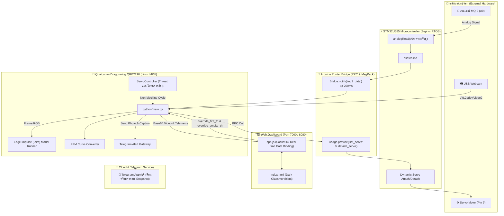
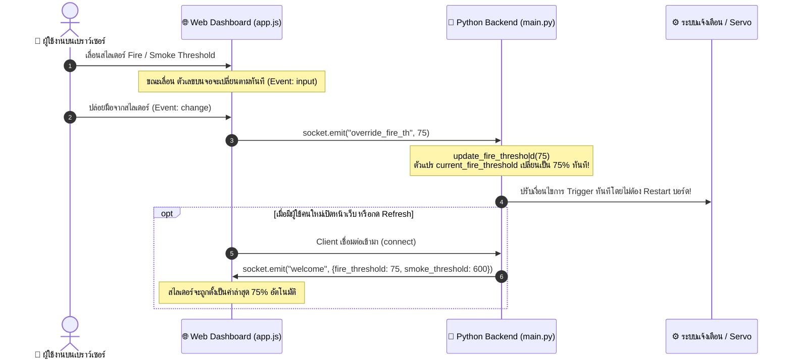

# 🔥 TelegramFireBot: AI Fire & Smoke Safeguard System (Arduino UNO Q)

ระบบตรวจจับอัคคีภัยและควันอัจฉริยะแบบบูรณาการ ออกแบบและปรับแต่งสำหรับบอร์ด **Arduino UNO Q (Qualcomm Dragonwing QRB2210 + STM32U585)** ผ่านแพลตฟอร์ม **Arduino App Lab** พร้อมระบบแสดงผลและควบคุมผ่าน Web Dashboard แบบเรียลไทม์ และระบบแจ้งเตือนฉุกเฉินผ่าน Telegram Bot

---

## 📑 สารบัญ (Table of Contents)

1. [ภาพรวมระบบและจุดเด่น (System Highlights)](#-ภาพรวมระบบและจุดเด่น-system-highlights)
2. [สถาปัตยกรรมการทำงาน (System Architecture)](#-สถาปัตยกรรมการทำงาน-system-architecture)
   - [สถาปัตยกรรม Dual-Brain](#1-สถาปัตยกรรม-dual-brain)
   - [การสื่อสารผ่าน Router Bridge](#2-การสื่อสารผ่าน-router-bridge)
   - [ระบบ Zero-Jitter Servo Control](#3-ระบบ-zero-jitter-servo-control)
   - [การคำนวณระดับควัน MQ-2 เป็นหน่วย ppm](#4-การคำนวณระดับควัน-mq-2-เป็นหน่วย-ppm)
3. [ผังการต่อวงจรและพินฮาร์ดแวร์ (Hardware Wiring & Pinout Guide)](#-ผังการต่อวงจรและพินฮาร์ดแวร์-hardware-wiring--pinout-guide)
   - [ตารางการต่อสายอุปกรณ์](#ตารางการต่อสายอุปกรณ์)
   - [คำแนะนำและข้อควรระวังเรื่องแรงดันไฟฟ้า](#คำแนะนำและข้อควรระวังเรื่องแรงดันไฟฟ้า)
   - [พื้นที่ใส่รูปภาพผังการต่อวงจรและอุปกรณ์จริง](#พื้นที่ใส่รูปภาพผังการต่อวงจรและอุปกรณ์จริง)
4. [การแสดงผล Web Dashboard และการปรับเปลี่ยนค่าบนเว็บ (Web Interface & Live Controls)](#-การแสดงผล-web-dashboard-และการปรับเปลี่ยนค่าบนเว็บ-web-interface--live-controls)
   - [องค์ประกอบหน้าจอแดชบอร์ด](#องค์ประกอบหน้าจอแดชบอร์ด)
   - [การปรับเปลี่ยนค่าเกณฑ์แจ้งเตือนผ่านสไลเดอร์แบบ Real-time](#การปรับเปลี่ยนค่าเกณฑ์แจ้งเตือนผ่านสไลเดอร์แบบ-real-time)
   - [กลไกการซิงค์ค่าระหว่าง Web Client และ Python Backend](#กลไกการซิงค์ค่าระหว่าง-web-client-และ-python-backend)
   - [พื้นที่ใส่รูปภาพหน้าจอ Web Dashboard](#พื้นที่ใส่รูปภาพหน้าจอ-web-dashboard)
5. [ขั้นตอนการนำเข้าสู่ Arduino App Lab (Importing App Guide)](#-ขั้นตอนการนำเข้าสู่-arduino-app-lab-importing-app-guide)
   - [การเตรียมไฟล์และโครงสร้างโฟลเดอร์](#การเตรียมไฟล์และโครงสร้างโฟลเดอร์)
   - [ขั้นตอนการ Import ทีละขั้นตอน](#ขั้นตอนการ-import-ทีละขั้นตอน)
   - [พื้นที่ใส่รูปภาพขั้นตอนการ Import](#พื้นที่ใส่รูปภาพขั้นตอนการ-import)
6. [การตั้งค่าให้แอปทำงานอัตโนมัติเมื่อเปิดเครื่อง (Autostart on Boot)](#-การตั้งค่าให้แอปทำงานอัตโนมัติเมื่อเปิดเครื่อง-autostart-on-boot)
   - [ขั้นตอนการเปิดใช้งาน Autostart](#ขั้นตอนการเปิดใช้งาน-autostart)
   - [การนำไปติดตั้งใช้งานจริงแบบ Standalone](#การนำไปติดตั้งใช้งานจริงแบบ-standalone)
   - [พื้นที่ใส่รูปภาพการตั้งค่า Autostart](#พื้นที่ใส่รูปภาพการตั้งค่า-autostart)
7. [คู่มือการเปลี่ยนและอัปเดตโมเดล AI (AI Model Replacement Guide)](#-คู่มือการเปลี่ยนและอัปเดตโมเดล-ai-ai-model-replacement-guide)
   - [เทคนิคแนะนำ: การตั้งชื่อไฟล์โมเดลเดิม](#เทคนิคแนะนำ-การตั้งชื่อไฟล์โมเดลเดิมเพื่อแทนที่ใน-zip)
   - [ขั้นตอนการลบแอปเดิมและ Import ใหม่ใน App Lab](#ขั้นตอนการลบแอปเดิมและ-import-ใหม่ใน-app-lab-เพื่อล้างแคช)
   - [กรณีต้องการเปลี่ยนชื่อไฟล์โมเดลเป็นชื่ออื่น](#กรณีต้องการเปลี่ยนชื่อไฟล์โมเดลเป็นชื่ออื่น)
8. [โครงสร้างไฟล์และโค้ดอย่างละเอียด (Project & Code Structure)](#-โครงสร้างไฟล์และโค้ดอย่างละเอียด-project--code-structure)
9. [การปรับแต่งพารามิเตอร์ระบบในโค้ด (Advanced Configuration)](#-การปรับแต่งพารามิเตอร์ระบบในโค้ด-advanced-configuration)
10. [การแก้ปัญหาที่พบบ่อย (Troubleshooting & FAQ)](#-การแก้ปัญหาที่พบบ่อย-troubleshooting--faq)

---

## 🌟 ภาพรวมระบบและจุดเด่น (System Highlights)

- **AI Fire Detection**: ตรวจจับเปลวไฟด้วยโมเดลคอมพิวเตอร์วิชั่นของ Edge Impulse (`wildfire-dt-model.eim`) จากภาพสดผ่าน **USB Webcam** แสดงผลกรอบ Bounding Box พร้อมระบุเปอร์เซ็นต์ความมั่นใจ
- **MQ-2 Smoke Sensor (A0)**: อ่านค่าระดับควันจากเซนเซอร์ MQ-2 ขา A0 แบบความเร็วสูง แปลงสัญญาณทางกายภาพเป็นหน่วย **ppm (Parts Per Million)** ด้วยสมการ Log-Exponential
- **Zero-Jitter Servo Actuator (Pin 9)**: ขับมอเตอร์เซอร์โวหมุน 90 องศาเพื่อจำลองการเปิดวาล์วฉีดสารดับเพลิงเป็นเวลา 10 วินาที หมุนกลับ 0 องศา และ **ตัดสัญญาณ PWM ทันที (`detach`)** ขณะสแตนด์บาย เพื่อแก้ปัญหามอเตอร์เซอร์โวสั่นกระตุกหรือเกิดเสียงฮัม 100%
- **Real-time Web Dashboard & Live Sliders**: หน้าจอเว็บมอนิเตอร์ระดับพรีเมียม สไตล์ Dark Glassmorphism สามารถ **ปรับแต่งเกณฑ์แจ้งเตือน (Thresholds) ผ่านสไลเดอร์บนหน้าเว็บได้ทันทีแบบ Real-time** โดยไม่ต้องหยุดหรือคอมไพล์โค้ดใหม่
- **Telegram Emergency Gateway**: แจ้งเตือนภัยอัคคีภัยทันทีผ่าน Telegram Bot พร้อมส่งภาพถ่ายเหตุการณ์ความละเอียดสูง (Snapshot with HUD Overlay), ข้อมูลค่าระดับไฟ/ควัน, เวลาตามโซนประเทศไทย และพิกัด GPS แผนที่ Google Maps
- **Standalone Autostart Ready**: รองรับการตั้งค่าให้เปิดเครื่องแล้วรันระบบเองโดยอัตโนมัติ (Autostart) ทำให้ติดตั้งใช้งานเป็นตู้เตือนภัยอัจฉริยะแบบอิสระได้ทันที

---

## 🏛️ สถาปัตยกรรมการทำงาน (System Architecture)



### 1. สถาปัตยกรรม Dual-Brain
Arduino UNO Q รวมเอา 2 หน่วยประมวลผลไว้ในบอร์ดเดียวกัน:
1. **STM32U585 Microcontroller (MCU)**: ทำหน้าที่ควบคุมด้านฮาร์ดแวร์แบบ Real-time I/O ทั้งการสุ่มอ่านค่า Analog ADC ขา A0 และการส่งสัญญาณ PWM ความถี่สูงควบคุมมุมเซอร์โวที่ขา Pin 9
2. **Qualcomm Dragonwing QRB2210 Linux MPU**: หน่วยประมวลผลหลักบนระบบปฏิบัติการ Linux ทำหน้าที่รันโมเดล AI Computer Vision ของ Edge Impulse, วิเคราะห์เฟรมวิดีโอจากกล้อง USB ด้วย OpenCV, รัน Web Server (Socket.IO) และสื่อสารกับเครือข่ายอินเทอร์เน็ตเพื่อส่ง Telegram API

### 2. การสื่อสารผ่าน Router Bridge
การแลกเปลี่ยนข้อมูลระหว่างโลกของ Linux และ MCU ทำงานผ่านไลบรารี `Arduino_RouterBridge`:
- **MCU $\rightarrow$ Linux (Stream Event)**: โค้ดฝั่ง MCU จะอ่านค่า Analog จากเซนเซอร์ MQ-2 และส่ง `Bridge.notify("mq2_data", raw)` ทุก 200ms ให้โค้ด Python ฝั่ง Linux รับไปประมวลผลต่อ
- **Linux $\rightarrow$ MCU (RPC Call)**: สคริปต์ Python สั่งการเซอร์โวมอเตอร์ผ่าน `Bridge.call("set_servo", angle)` และ `Bridge.call("detach_servo")`

### 3. ระบบ Zero-Jitter Servo Control
เซอร์โวมอเตอร์ทั่วไปหากได้รับสัญญาณ PWM 50Hz ค้างไว้แม้จะไม่ได้สั่งเคลื่อนที่ มักจะเกิดปัญหาเรื่อง **เสียงฮัม (Humming noise)** หรือมี **อาการสั่นกระตุก (Idle Jitter)** ตลอดเวลา ในระบบนี้จึงใช้เทคนิค **Dynamic Attach/Detach**:
1. **ขณะ Standby**: โค้ดสั่ง `fireServo.detach()` ดับสัญญาณ PWM ทำให้เซอร์โวนิ่งสนิท ไม่กินกระแส และไม่มีเสียงรบกวน
2. **เมื่อพบไฟ (Fire $\ge$ Threshold)**: สั่ง `fireServo.attach(9)` $\rightarrow$ หมุนไปที่ 90 องศา $\rightarrow$ ค้างไว้ 10 วินาทีเพื่อจำลองการฉีดดับเพลิง
3. **เมื่อครบเวลา**: สั่งหมุนกลับมาที่ 0 องศา $\rightarrow$ หน่วงเวลา 1.5 วินาทีให้มอเตอร์วิ่งเข้าตำแหน่งสมบูรณ์ $\rightarrow$ สั่ง `detach()` ปิดสัญญาณ PWM
4. **Cooldown 60 วินาที**: ป้องกันกลไกทำงานซ้ำซ้อนอย่างต่อเนื่อง หากครบ 60 วินาทีแล้วยังตรวจพบไฟอยู่ ระบบจะสั่งวนลูปทำงานซ้ำอัตโนมัติ

### 4. การคำนวณระดับควัน MQ-2 เป็นหน่วย ppm
ฟังก์ชัน `raw_to_smoke_ppm(raw_val)` แปลงค่าดิบจาก Analog ADC (0–1023) เป็นค่าความหนาแน่นของควันในหน่วย **ppm (Parts Per Million)** ตามความโค้งการตอบสนองของเซนเซอร์ MQ-2:
$$\text{ppm} = 50.0 \times \left(1.0 + \left(\frac{\text{raw}}{80.0}\right)^{1.8}\right)$$
- **อากาศบริสุทธิ์ (Clean Air)**: $\approx 50 - 150 \text{ ppm}$
- **ควันจางๆ (Mild Smoke)**: $\approx 300 - 500 \text{ ppm}$
- **ควันหนาแน่น (Dense Smoke / Fire Hazard)**: $\ge 600 - 3,000 \text{ ppm}$

---

## 🔌 ผังการต่อวงจรและพินฮาร์ดแวร์ (Hardware Wiring & Pinout Guide)

### ตารางการต่อสายอุปกรณ์

| อุปกรณ์ | ขาบนตัวอุปกรณ์ | สีสายไฟมาตรฐาน | ขาบนบอร์ด Arduino UNO Q | คำอธิบายหน้าที่ |
| :--- | :--- | :--- | :--- | :--- |
| **เซนเซอร์ MQ-2** | **VCC** | สีแดง | **5V** | ขาจ่ายไฟเลี้ยงโมดูลเซนเซอร์ |
| | **GND** | สีดำ | **GND** | ขากราวด์ร่วมของระบบ |
| | **AO (Analog Out)** | สีเขียว / ขาว | **A0 (Analog In)** | สัญญาณแรงดันอนาล็อกระดับควัน/ก๊าซ |
| **Servo Motor** | **VCC** | สีแดง | **5V** | ขาจ่ายไฟเลี้ยงแกนมอเตอร์ |
| | **GND** | สีน้ำตาล / สีดำ | **GND** | ขากราวด์ร่วมของระบบ |
| | **Signal (PWM)** | สีส้ม / สีเหลือง | **Pin 9 (D9 / PWM)** | สัญญาณพัลส์ควบคุมองศาการหมุน |
| **USB Webcam** | **USB-A Plug** | สาย USB ดั้งเดิม | **USB Host Port** | เสียบเข้าช่องพอร์ต USB-A ของบอร์ด UNO Q |

### คำแนะนำและข้อควรระวังเรื่องแรงดันไฟฟ้า

> [!WARNING]
> **ข้อควรระวังเรื่องแรงดันไฟขา Analog (A0):**
> 1. ขา Analog A0–A5 บนบอร์ด Arduino UNO Q รองรับแรงดันอินพุตสูงสุดไม่เกิน **3.3V** 
> 2. บอร์ดโมดูล MQ-2 ทั่วไปที่ใช้ไฟเลี้ยง 5V อาจปล่อยแรงดันขา AO ออกมาได้สูงสุด 4–5V เมื่อเจอกลุ่มควันหนาแน่นมาก
> 3. **คำแนะนำในการติดตั้ง:**
>    - หมุนปรับตัวต้านทานปรับค่าได้ (Potentiometer สีฟ้า) บนตัวโมดูล MQ-2 เพื่อปรับระดับความไวให้อยู่ในย่านปลอดภัย
>    - หรือต่อวงจรแบ่งแรงดัน (Voltage Divider) โดยใช้ตัวต้านทาน $1\text{k}\Omega$ และ $2\text{k}\Omega$ คั่นก่อนเข้าขา A0
>
> **การวอร์มเซนเซอร์ (Burn-in Time):**
> เซนเซอร์ตระกูล MQ ทุกรุ่นมีขดลวดความร้อนภายใน เมื่อเสียบไฟใช้งานครั้งแรกจะต้องรอประมาณ **3–5 นาที** เพื่อให้เซนเซอร์อุ่นและอ่านค่าได้อย่างคงที่และแม่นยำ

---

### พื้นที่ใส่รูปภาพผังการต่อวงจรและอุปกรณ์จริง

> 📸 **[ช่องใส่รูปภาพที่ 1: ผังวงจรไดอะแกรมการต่อสาย (Schematic / Wiring Diagram)]**
>
> *(นำไฟล์รูปภาพผังวงจรมาบันทึกในโฟลเดอร์ `assets/images/wiring_diagram.png` หรือเปลี่ยนที่อยู่รูปภาพในบรรทัดด้านล่าง)*
>
> 

<br>

> 📸 **[ช่องใส่รูปภาพที่ 2: ภาพถ่ายการต่อวงจรฮาร์ดแวร์จริง (Actual Hardware Setup)]**
>
> *(นำภาพถ่ายบอร์ด Arduino UNO Q ที่ต่อเข้ากับ MQ-2, Servo Motor และ USB Webcam มาบันทึกในโฟลเดอร์ `assets/images/hardware_setup.jpg`)*
>
> 

---

## 💻 การแสดงผล Web Dashboard และการปรับเปลี่ยนค่าบนเว็บ (Web Interface & Live Controls)

ระบบ TelegramFireBot มาพร้อมกับหน้าจอแดชบอร์ด **Web Dashboard** ควบคุมและแสดงผลแบบเรียลไทม์ผ่าน WebSocket (Socket.IO) ทำงานที่พอร์ต **`7000`** (หรือ `8080` ตามคอนฟิก):
- เข้าใช้งานภายในบอร์ด: `http://localhost:7000`
- เข้าใช้งานจากคอมพิวเตอร์หรือสมาร์ตโฟนผ่าน Wi-Fi วงเดียวกัน: `http://<IP_ของบอร์ด_UNO_Q>:7000`

```
+-----------------------------------------------------------------------------------+
|  🔥 Fire & Smoke AI - Safeguard Monitoring System            ● Connected (Green) |
+-----------------------------------------------------------------------------------+
| [ แผงหลัก: วิดีโอสด ]             | [ แผงด้านข้าง: Telemetry & Controls ]         |
|                                  |                                               |
| +------------------------------+ | 📊 Telemetry Status                           |
| | 🔴 LIVE FEED                  | | - Fire Level (AI):  [████████░░░] 82.5% (Red)  |
| |                              | | - Smoke Level:      [████░░░░░░] 750 ppm     |
| |   [ กล้อง USB Webcam ]        | |   Sensor Raw (A0): 405                      |
| |                              | |                                               |
| | ┌──────────────────────────┐ | | ⚙️ Servo Actuator (Pin 9)                     |
| | │ HUD TELEMETRY OVERLAY    │ | | - Status: ACTIVE (90°)                        |
| | │ Fire (AI): 82.5% (Th:80%)│ | | - Angle Position: 90°                        |
| | │ Smoke: 750 ppm (Th:600)  │ | | - Cooldown: 60s                               |
| | │ Servo: ACTIVE (90 deg)   │ | |                                               |
| | └──────────────────────────┘ | | 🎚️ Alert Thresholds (Real-time Sliders)       |
| |                              | | - 🔥 Fire Camera Threshold: [====O====] 80%   |
| |   [กรอบ AI Bounding Box ไฟ]  | | - 💨 Smoke Sensor Threshold:[==O======] 600ppm|
| +------------------------------+ |                                               |
|                                  | 🚨 Telegram Gateway                           |
|                                  | - Total Dispatched: 3                         |
|                                  | - Last Status: Success                        |
|                                  | - History Logs: [14:25:30, 14:26:15]          |
+-----------------------------------------------------------------------------------+
```

### องค์ประกอบหน้าจอแดชบอร์ด

1. **🔴 Live Video Feed (การ์ดแสดงผลกล้องสด)**
   - สตรีมภาพวิดีโอความละเอียดสูงจากกล้อง USB Webcam แบบ Base64 JPEG อัตราเร่งประมาณ 25 FPS
   - **AI Bounding Box**: เมื่อโมเดลตรวจพบเปลวไฟ ระบบจะวาดกรอบสี่เหลี่ยมสีแดงครอบตำแหน่งของไฟบนภาพแบบสด พร้อมระบุเปอร์เซ็นต์ความมั่นใจ
   - **HUD Telemetry Overlay**: มีกล่องมอนิเตอร์สีดำโปร่งแสงซ้อนอยู่มุมบนซ้ายของภาพ แสดงข้อมูลสด:
     - `Fire (AI): X% (Th: Y%)`
     - `Smoke (MQ2): X ppm (Th: Y)`
     - `Servo (Pin 9): STATE (Angle/Countdown)`
2. **📊 Telemetry Status (มาตรวัดระดับเซนเซอร์)**
   - **🔥 Fire Level (AI)**: มาตรวัดความมั่นใจของ AI พร้อมแท่ง Progress Bar แสดง 0–100% (ตัวเลขและแท่งจะเปลี่ยนจากสีเขียวเป็นสีแดงทันทีเมื่อระดับไฟแตะเกณฑ์)
   - **💨 Smoke Level (MQ-2 A0)**: แสดงความเข้มข้นของควันเป็นหน่วย **ppm** พร้อมแท่ง Progress Bar สเกล 0–3,000 ppm และแสดงค่าดิบ `Sensor Raw (A0): XXX` ด้านล่าง
3. **⚙️ Servo Actuator Panel (แผงสถานะเซอร์โว Pin 9)**
   - แสดงสถานะการทำงาน 3 สภาวะ:
     - **`STANDBY` (สีเขียว)**: เซอร์โวหยุดนิ่ง ตัดสัญญาณ PWM (`detach`) ไร้การสั่นไหว
     - **`ACTIVE` (สีแดง)**: กำลังหมุนไปที่ 90 องศาเพื่อเปิดระบบดับเพลิง (หน่วงเวลา 10 วินาที)
     - **`COOLDOWN` (สีส้ม)**: หมุนกลับมาที่ 0 องศา ตัดสัญญาณ PWM และแสดงเวลานับถอยหลัง `60s... 59s...`
4. **🚨 Telegram Gateway Panel (ประวัติการส่งแจ้งเตือน)**
   - แสดงตัวเลขจำนวนครั้งที่ส่งแจ้งเตือนสำเร็จ (`Total Dispatched`)
   - แสดงสถานะล่าสุดของการส่ง (`Last Gateway Status: Standby / Success / Failed`)
   - กล่อง `History Logs` แสดงประวัติเวลาของเหตุการณ์ฉุกเฉินล่าสุด

---

### การปรับเปลี่ยนค่าเกณฑ์แจ้งเตือนผ่านสไลเดอร์แบบ Real-time

บนหน้าเว็บมีแถบสไลเดอร์ให้ผู้ควบคุมสามารถปรับค่าเกณฑ์ความไว (Thresholds) ได้อย่างอิสระตามสภาพแวดล้อมจริง:

1. **🔥 Fire Camera Threshold (สไลเดอร์เกณฑ์ตรวจจับไฟ)**:
   - ปรับได้ตั้งแต่ **1% ถึง 100%** (ค่าเริ่มต้น: `80%`)
   - **ผลลัพธ์**: หากความมั่นใจของ AI มีค่ามากกว่าหรือเท่ากับค่านี้ ระบบจะ:
     - สั่งให้เซอร์โวมอเตอร์หมุน 90 องศาฉีดสารดับเพลิง
     - สั่งให้ระบบถ่ายภาพ Snapshot ส่งแจ้งเตือนฉุกเฉินเข้า Telegram
2. **💨 Smoke Sensor Threshold (สไลเดอร์เกณฑ์ระดับควัน)**:
   - ปรับได้ตั้งแต่ **100 ถึง 3,000 ppm** โดยขยับครั้งละ 50 ppm (ค่าเริ่มต้น: `600 ppm`)
   - **ผลลัพธ์**: หากระดับควันที่อ่านได้จากขา A0 มีค่ามากกว่าหรือเท่ากับค่านี้ ระบบจะ:
     - สั่งให้ระบบถ่ายภาพ Snapshot ส่งแจ้งเตือนฉุกเฉินเข้า Telegram เพื่อแจ้งเตือนว่ามีกลุ่มควันผิดปกติ

### กลไกการซิงค์ค่าระหว่าง Web Client และ Python Backend



> [!TIP]
> **ไม่ต้องหยุดโปรแกรม ไม่ต้องรีสตาร์ต:** การปรับสไลเดอร์บนหน้าเว็บจะส่งสัญญาณผ่าน Socket.IO อัปเดตตัวแปรในหน่วยความจำของ Python ทันที ทำให้คุณสามารถจูนเกณฑ์ความไวของเซนเซอร์และกล้องให้เข้ากับแสงและควันในห้องทดสอบได้แบบสดๆ ตลอดเวลา

---

### พื้นที่ใส่รูปภาพหน้าจอ Web Dashboard

> 📸 **[ช่องใส่รูปภาพที่ 3: หน้าจอ Web Dashboard สภาวะปกติ (Normal Standby State)]**
>
> *(นำภาพหน้าจอแดชบอร์ดขณะไม่มีไฟและควัน บันทึกในโฟลเดอร์ `assets/images/web_dashboard_standby.png`)*
>
> 

<br>

> 📸 **[ช่องใส่รูปภาพที่ 4: หน้าจอ Web Dashboard ขณะตรวจพบไฟและควัน (Alert & Active State)]**
>
> *(นำภาพหน้าจอแดชบอร์ดที่มีกรอบ AI สีแดงตีกรอบไฟ และระดับควันพุ่งสูง บันทึกในโฟลเดอร์ `assets/images/web_dashboard_alert.png`)*
>
> 

---

## 🚀 ขั้นตอนการนำเข้าสู่ Arduino App Lab (Importing App Guide)

### การเตรียมไฟล์และโครงสร้างโฟลเดอร์

ก่อนเริ่มนำเข้าสู่โปรแกรม Arduino App Lab ให้ตรวจสอบว่าไฟล์โปรเจกต์มีโครงสร้างครบถ้วนดังนี้:

```
TelegramFireBot/
├── app.yaml                 # ไฟล์คอนฟิกแอปหลักของ App Lab
├── wildfire-dt-model.eim    # โมเดล Edge Impulse (.eim)
├── python/
│   ├── main.py              # โค้ดหลักฝั่ง Linux (Webcam, AI, Bridge, Servo, Telegram)
│   └── requirements.txt     # ระบุไลบรารี edge_impulse_linux
├── sketch/
│   ├── sketch.ino           # โค้ด MCU STM32 อ่าน A0 และคุม Servo
│   └── sketch.yaml          # คอนฟิกไลบรารี Arduino_RouterBridge และ Servo
└── assets/
    ├── index.html           # หน้ากาก Web Dashboard
    ├── style.css            # สไตล์ Dark Glassmorphism
    ├── app.js               # สคริปต์ Socket.IO รับส่งข้อมูล
    └── libs/                # ไลบรารีออฟไลน์ socket.io และ qrcode
```

> [!TIP]
> คุณสามารถเลือกนำเข้าได้ 2 รูปแบบ:
> 1. นำเข้าเป็น **โฟลเดอร์โปรเจกต์ `TelegramFireBot`** โดยตรง
> 2. บีบอัดโฟลเดอร์ให้เป็นไฟล์ **`TelegramFireBot.zip`** (โดยข้างใน Zip ต้องประกอบด้วยไฟล์ `app.yaml`, โฟลเดอร์ `python/`, `sketch/`, `assets/` อยู่ที่ Root ของ Zip ทันที)

---

### ขั้นตอนการ Import ทีละขั้นตอน

1. **เปิดโปรแกรม Arduino App Lab**:
   - เชื่อมต่อบอร์ด **Arduino UNO Q** เข้ากับคอมพิวเตอร์ผ่านสาย Type-C
   - เปิดโปรแกรม **Arduino App Lab** แล้วรอให้โปรแกรมตรวจสอบสถานะของบอร์ดจนขึ้นว่าเชื่อมต่อเรียบร้อย
2. **เข้าสู่เมนูนำเข้าแอป (Import App)**:
   - ที่หน้าหลักของโปรแกรม มองหาปุ่ม **"Import App"** (หรือคลิกที่เครื่องหมาย **`+`** / Add Application)
3. **เลือกไฟล์โปรเจกต์**:
   - เลือกตัวเลือก **Import from ZIP** (เลือกไฟล์ `TelegramFireBot.zip`) หรือ **Import from Folder** (เลือกโฟลเดอร์โปรเจกต์)
4. **รอ App Lab เตรียมสภาพแวดล้อม**:
   - โปรแกรมจะอ่านไฟล์ `app.yaml` เพื่อดึง Bricks ที่เกี่ยวข้อง (`video_object_detection`, `web_ui`)
   - โปรแกรมจะสร้าง Python Virtual Environment และติดตั้งไลบรารีจาก `python/requirements.txt`
   - โปรแกรมจะคอมไพล์และแฟลชเฟิร์มแวร์ในโฟลเดอร์ `sketch/` ลงสู่ชิป STM32U585 ด้วย Zephyr RTOS ให้โดยอัตโนมัติ
5. **เริ่มการทำงาน (Run)**:
   - กดปุ่ม **"Run"** สีเขียวที่มุมบนขวา
   - ตรวจสอบหน้าต่าง Logs เพื่อดูสถานะการเปิดกล้อง USB Webcam และการโหลดโมเดล AI
   - คลิกเปิดหน้า Web Dashboard ที่พอร์ต `7000` เพื่อเริ่มใช้งาน

---

### พื้นที่ใส่รูปภาพขั้นตอนการ Import

> 📸 **[ช่องใส่รูปภาพที่ 5: หน้าจอการกด Import App ในโปรแกรม Arduino App Lab]**
>
> *(นำภาพหน้าจอขั้นตอนการกดเลือกไฟล์ Zip หรือโฟลเดอร์ใน App Lab มาบันทึกใน `assets/images/app_lab_import.png`)*
>
> 

<br>

> 📸 **[ช่องใส่รูปภาพที่ 6: หน้าจอการกดปุ่ม Run และดู Log การทำงาน]**
>
> *(นำภาพหน้าจอขณะกด Run สำเร็จและมีคอนโซลแสดงผลมาบันทึกใน `assets/images/app_lab_run.png`)*
>
> 

---

## ⚡ การตั้งค่าให้แอปทำงานอัตโนมัติเมื่อเปิดเครื่อง (Autostart on Boot)

เมื่อคุณต้องการนำบอร์ด Arduino UNO Q ไปประกอบลงกล่อง และติดตั้งในอาคารหรือโรงงานเพื่อใช้งานเป็นอุปกรณ์เตือนภัยอัคคีภัยแบบ **Standalone (ทำงานเดี่ยวๆ โดยไม่ต้องต่อคอมพิวเตอร์)** คุณต้องเปิดใช้งานฟังก์ชัน **Autostart**:

### ขั้นตอนการเปิดใช้งาน Autostart

1. เปิดโปรแกรม **Arduino App Lab** ขณะที่เชื่อมต่อกับบอร์ด
2. ไปที่หน้าแท็บ **Apps** หรือหน้ารายการแอปที่ติดตั้งอยู่บนบอร์ด (Installed Applications)
3. ค้นหาการ์ดแอปพลิเคชัน **`TelegramFireBot`**
4. มองหาสวิตช์ Toggle หรือตัวเลือกที่เขียนว่า **"Autostart"** หรือ **"Run on startup"**
   - หรือคลิกที่ปุ่มเมนูจุด 3 จุด (`...`) บนการ์ดแอป แล้วเลือกคำสั่ง **"Set as Autostart"**
5. เลื่อนสวิตช์ให้เป็น **ON (เปิดใช้งาน)**
6. สังเกตจะมีสัญลักษณ์ไอคอนรูปเข็มกลัดหรือข้อความสีเขียวระบุว่า **`Autostart: Enabled`** บนการ์ดแอป

```
+-------------------------------------------------------------+
| 🔥 TelegramFireBot                             [ Run / Stop ]|
| Fire and Smoke Detection with Telegram Alert                 |
|                                                             |
| Status: Installed                                           |
| Autostart: [  ON  ] ⚡ (Runs automatically on device boot)   |
| Ports: 7000 / 8080                                          |
|                                         [ Logs ] [ Settings ]|
+-------------------------------------------------------------+
```

### การนำไปติดตั้งใช้งานจริงแบบ Standalone

- **การจ่ายไฟ**: สามารถใช้ Adapter จ่ายไฟ 5V (กระแสอย่างน้อย 2.5A - 3A) เสียบเข้าช่อง Type-C ของบอร์ด Arduino UNO Q ได้โดยตรง
- **ลำดับการบูตเครื่องอัตโนมัติ (Cold Boot Workflow)**:
  1. เมื่อเสียบปลั๊กไฟ บอร์ดจะเริ่มบูตระบบ Linux บนชิป Qualcomm และบูต Zephyr RTOS บนชิป STM32 (~20-30 วินาที)
  2. ระบบ Autostart จะสั่งเปิดคอนเทนเนอร์ของ TelegramFireBot ขึ้นมาทันที
  3. กล้อง USB Webcam จะเปิดทำงาน โมเดล AI จะถูกโหลดเข้าสู่ RAM และเซนเซอร์ MQ-2 จะเริ่มสตรีมข้อมูล
  4. มอเตอร์เซอร์โวจะอยู่ในโหมด Standby ตัดสัญญาณ PWM เพื่อป้องกันการสั่น
  5. บอร์ดจะเชื่อมต่อ Wi-Fi และพร้อมส่งแจ้งเตือน Telegram ทันทีที่มีเหตุเพลิงไหม้เกิดขึ้น แม้ไม่มีคอมพิวเตอร์เชื่อมต่ออยู่ก็ตาม!

---

### พื้นที่ใส่รูปภาพการตั้งค่า Autostart

> 📸 **[ช่องใส่รูปภาพที่ 7: การเปิดสวิตช์ Autostart บนการ์ดแอปใน Arduino App Lab]**
>
> *(นำภาพหน้าจอการคลิกเปิด Autostart มาบันทึกใน `assets/images/app_lab_autostart.png`)*
>
> 

---

## 🧠 คู่มือการเปลี่ยนและอัปเดตโมเดล AI (AI Model Replacement Guide)

หากในอนาคตคุณได้รวบรวมรูปภาพเปลวไฟเพิ่มเติม และได้ฝึกฝนโมเดลใหม่ใน **Edge Impulse** เพื่อให้ตรวจจับได้แม่นยำยิ่งขึ้น นี่คือวิธีนำโมเดลตัวใหม่มาแทนที่ที่ง่ายที่สุด สะอาดที่สุด และไม่เกิดข้อผิดพลาด:

### เทคนิคแนะนำ: การตั้งชื่อไฟล์โมเดลเดิมเพื่อแทนที่ใน ZIP

> [!IMPORTANT]
> **เคล็ดลับระดับโปร (Best Practice):**
> เพื่อไม่ให้ต้องเข้าไปแก้ไขโค้ดใน `app.yaml` หรือแก้ชื่อไฟล์ใน `python/main.py` แม้แต่บรรทัดเดียว **ให้เปลี่ยนชื่อไฟล์โมเดลใหม่ที่ดาวน์โหลดมา ให้เป็นชื่อเดิมเสมอ!**

#### ขั้นตอนการทำ:
1. **ดาวน์โหลดโมเดลจาก Edge Impulse**:
   - เข้าสู่โปรเจกต์ของคุณบน **Edge Impulse Studio**
   - ไปที่เมนู **Deployment**
   - ในส่วน Search deployment options ให้เลือก **Linux (ARM)** หรือ **Linux (AARCH64)** ตามสถาปัตยกรรมชิป
   - คลิกปุ่ม **Build** เพื่อดาวน์โหลดไฟล์โมเดล ซึ่งจะได้ไฟล์นามสกุล `.eim` ออกมา (เช่น `my-new-fire-model.eim`)
2. **เปลี่ยนชื่อไฟล์ให้เป็นชื่อเดิม**:
   - เปลี่ยนชื่อไฟล์ที่เพิ่งดาวน์โหลดมาให้กลายเป็น:
     ```bash
     wildfire-dt-model.eim
     ```
3. **นำไปวางแทนที่ในไฟล์ ZIP หรือโฟลเดอร์โปรเจกต์**:
   - นำไฟล์ `wildfire-dt-model.eim` ตัวใหม่ ไปคัดลอกทับ (Overwrite/Replace) ไฟล์เดิมในโฟลเดอร์โปรเจกต์
   - หรือหากใช้ไฟล์ ZIP ให้เปิดไฟล์ `TelegramFireBot.zip` แล้วลากไฟล์ `wildfire-dt-model.eim` ตัวใหม่ลงไปวางทับตัวเดิมข้างในได้ทันที

---

### ขั้นตอนการลบแอปเดิมและ Import ใหม่ใน App Lab เพื่อล้างแคช

เมื่อมีการเปลี่ยนไฟล์ไบนารีของโมเดล การกด Stop แล้ว Run ใหม่อาจทำให้ระบบไปดึงเอาโมเดลตัวเก่าจากแคชคอนเทนเนอร์มาใช้ **ดังนั้นวิธีที่ถูกต้องและสะอาดที่สุด 100% คือการลบแอปเดิมออกก่อน แล้ว Import เข้ามาใหม่**:

```
[ 1. กด Stop แอปเดิม ]
          ↓
[ 2. คลิกปุ่ม '...' บนการ์ดแอป แล้วเลือก 'Delete' / 'Remove' ลบแอปเดิมออก ]
          ↓
[ 3. คลิก 'Import App' แล้วเลือกไฟล์ Zip หรือโฟลเดอร์ที่แทนที่โมเดลใหม่แล้ว ]
          ↓
[ 4. กด 'Run' เพื่อให้ App Lab คอมไพล์และโหลดโมเดลใหม่อย่างสะอาดบริสุทธิ์ ]
```

1. ในหน้าจอ **Arduino App Lab** ให้กดปุ่ม **Stop** เพื่อหยุดการทำงานของแอป `TelegramFireBot`
2. คลิกที่ปุ่มเมนูตัวเลือกจุดสามจุด **`...`** บนการ์ดแอป แล้วเลือกคำสั่ง **Delete** หรือ **Remove Application** เพื่อลบแอปเดิมออกจากระบบ
3. คลิกที่ปุ่ม **Import App**
4. เลือกไฟล์ `TelegramFireBot.zip` ตัวใหม่ (หรือโฟลเดอร์โปรเจกต์ที่แทนที่โมเดลแล้ว)
5. รอ App Lab แตกไฟล์และจัดเตรียมคอนเทนเนอร์ จากนั้นกดปุ่ม **Run**
6. ตรวจสอบที่หน้าต่าง Logs จะพบข้อความ:
   ```
   Ensured executable permissions for /.../wildfire-dt-model.eim
   Edge Impulse model initialized successfully from: /.../wildfire-dt-model.eim
   Model info: ...
   ```
   แสดงว่าโมเดลตัวใหม่ได้รับการโหลดและพร้อมทำงานอย่างสมบูรณ์!

---

### กรณีต้องการเปลี่ยนชื่อไฟล์โมเดลเป็นชื่ออื่น

หากคุณไม่ต้องการใช้ชื่อเดิม และต้องการตั้งชื่อไฟล์โมเดลเป็นชื่ออื่น เช่น `fire-v2-model.eim` คุณจะต้องแก้ไขคอนฟิก 2 จุดดังต่อไปนี้:

1. **แก้ไขไฟล์ [`app.yaml`](file:///home/ctrlaltnate/Downloads/TelegramFireBot/TelegramFireBot/app.yaml)** (บรรทัดที่ 8–9):
   ```yaml
   bricks:
   - arduino:video_object_detection:
       variables:
         EI_OBJ_DETECTION_MODEL: /home/arduino/.arduino-bricks/ei-models/fire-v2-model.eim
         EI_V_OBJ_DETECTION_MODEL: /home/arduino/.arduino-bricks/ei-models/fire-v2-model.eim
   ```
2. **แก้ไขไฟล์ [`python/main.py`](file:///home/ctrlaltnate/Downloads/TelegramFireBot/TelegramFireBot/python/main.py)** (บรรทัดที่ 42):
   ```python
   # Edge Impulse Model Path
   MODEL_PATH = "fire-v2-model.eim"
   ```

---

## 📂 โครงสร้างไฟล์และโค้ดอย่างละเอียด (Project & Code Structure)

### 1. `app.yaml`
ไฟล์ประกาศคุณลักษณะแอปพลิเคชันสำหรับ **Arduino App Lab**:
- กำหนดชื่อแอป `TelegramFireBot` และไอคอน 🔥
- เปิดพอร์ตสื่อสาร `8080` สำหรับระบบ WebUI
- ผูกโมเดล Edge Impulse ผ่าน Brick `arduino:video_object_detection`
- เรียกใช้คอมโพเนนต์เว็บเซิร์ฟเวอร์ผ่าน Brick `arduino:web_ui`

### 2. `python/main.py`
แกนกลางของระบบที่ประมวลผลบน Linux MPU (Qualcomm Dragonwing):
- **ระบบ Auto-chmod โมเดล**: มีคำสั่ง `os.chmod()` อัตโนมัติ ป้องกัน Error สิทธิ์การ Execute (`+x`) ของไฟล์ `.eim`
- **คลาส `ServoController`**: ควบคุมเซอร์โวมอเตอร์แบบ State Machine ผ่านเธรดแยก (`threading.Thread`) ทำให้การหน่วงเวลา 10 วินาที และการนับถอยหลัง Cooldown 60 วินาที ไม่ไปหน่วงการประมวลผลของกล้องวิดีโอและหน้าเว็บ
- **ฟังก์ชัน `raw_to_smoke_ppm()`**: แปลงค่า ADC จากขา A0 เป็นหน่วย ppm อ้างอิงสมการ Exponential Curve
- **ฟังก์ชัน `trigger_telegram_alert()`**: เข้ารหัสภาพถ่ายเป็น JPEG ความละเอียดสูง แนบพิกัด Google Maps วันที่และเวลาโซนไทย ส่งผ่าน Telegram Bot API พร้อมระบบป้องกันสแปม `TELEGRAM_COOLDOWN` 20 วินาที
- **ระบบ Socket.IO Handlers**:
  - รับสัญญาณ `override_fire_th` และ `override_smoke_th` จากสไลเดอร์หน้าเว็บมาปรับเกณฑ์ทันที
  - ส่งข้อมูล `detection`, `servo_status`, `telegram_status` และสตรีมภาพ `video_frame` ไปยังหน้าเว็บแบบเรียลไทม์

### 3. `sketch/sketch.ino` & `sketch.yaml`
เฟิร์มแวร์ฝั่งชิปไมโครคอนโทรลเลอร์ STM32U585:
- `sketch.yaml`: กำหนดโปรไฟล์บอร์ด `arduino:zephyr:unoq` และนำเข้าไลบรารี `Arduino_RouterBridge` และ `Servo`
- `sketch.ino`:
  - ฟังก์ชัน `read_mq2()`: อ่านค่า `analogRead(A0)`
  - ฟังก์ชัน `set_servo(angle)`: สั่ง `fireServo.attach(9)` เมื่อต้องการหมุน และสั่ง `fireServo.write(angle)`
  - ฟังก์ชัน `detach_servo()`: สั่ง `fireServo.detach()` เพื่อตัดสัญญาณ PWM อย่างเด็ดขาด ป้องกันเซอร์โวสั่น
  - ในฟังก์ชัน `loop()`: ส่ง `Bridge.notify("mq2_data", mq2_raw)` ไปยัง Python ทุก 200ms

### 4. `assets/` (Web Dashboard)
- `index.html`: โครงสร้างหน้าเว็บ แบ่งเป็นแผงวิดีโอสด (Live Feed) พร้อม HUD Overlay, แผง Telemetry, แผงเซอร์โว, สไลเดอร์ปรับเกณฑ์คู่ และประวัติแจ้งเตือน Telegram
- `style.css`: ตกแต่งด้วยธีม Dark Glassmorphism ผสมผสาน Neon Glow, Smooth Gradient และรองรับ Responsive บนแท็บเล็ต/มือถือ
- `app.js`: เชื่อมต่อ Socket.IO, ซิงค์ข้อมูลสไลเดอร์แบบ 2-way data binding, และแสดงแอนิเมชันสถานะต่างๆ

---

## ⚙️ การปรับแต่งพารามิเตอร์ระบบในโค้ด (Advanced Configuration)

หากต้องการแก้ไขการตั้งค่าเริ่มต้นของระบบ ให้เปิดไฟล์ [`python/main.py`](file:///home/ctrlaltnate/Downloads/TelegramFireBot/TelegramFireBot/python/main.py) และปรับแต่งพารามิเตอร์ในบรรทัดที่ 27–47:

| ตัวแปรในโค้ด | ค่าเริ่มต้น | รายละเอียดและการตั้งค่า |
| :--- | :--- | :--- |
| `INPUT_MODE` | `"WEBCAM"` | โหมดรับภาพ: ใช้ `"WEBCAM"` สำหรับกล้อง USB ทั่วไป |
| `TELEGRAM_TOKEN` | `"8859583...nmXI"` | Bot Token ที่ได้รับจาก `@BotFather` |
| `TELEGRAM_CHAT_ID` | `"7246017877"` | Chat ID ของผู้ใช้ หรือ Group ID ของกลุ่ม Telegram ที่ต้องการรับแจ้งเตือน |
| `DEFAULT_FIRE_THRESHOLD` | `80.0` | เกณฑ์ความมั่นใจตรวจจับไฟเริ่มต้น (1% – 100%) หากแตะเกณฑ์จะหมุน Servo และส่ง Telegram |
| `DEFAULT_SMOKE_THRESHOLD` | `600.0` | เกณฑ์ระดับควันเริ่มต้น (100 – 3,000 ppm) หากแตะเกณฑ์จะส่ง Telegram |
| `TELEGRAM_COOLDOWN` | `20` | ระยะเวลาหน่วงระหว่างการส่ง Telegram แต่ละข้อความ (วินาที) ป้องกันข้อความสแปม |
| `LATITUDE` / `LONGITUDE` | `"-"` | พิกัดจุดติดตั้งของกล่อง ใช้สร้างลิงก์เปิดแผนที่ Google Maps ในข้อความเตือน |
| `MODEL_PATH` | `"wildfire-dt-model.eim"` | ชื่อไฟล์โมเดล Edge Impulse ที่ต้องการโหลด |

---

## 🛠️ การแก้ปัญหาที่พบบ่อย (Troubleshooting & FAQ)

#### Q1: ภาพจากกล้อง USB ไม่แสดง หรือขึ้นข้อความแจ้งว่ากล้องเปิดไม่ได้?
- **สาเหตุ**: บนบอร์ด Arduino UNO Q กล้อง USB มาตรฐาน UVC อาจถูกแมปเป็นอุปกรณ์ตำแหน่งอื่น เช่น `/dev/video2` หรือ `/dev/video0`
- **วิธีแก้ปัญหา**: สคริปต์ `open_usb_camera()` ในโค้ดปัจจุบันถูกออกแบบให้ทดสอบเปิดกล้องตามลำดับ `[2, 0, 1]` โดยอัตโนมัติแล้ว หากยังไม่ติด ให้ตรวจสอบว่าเสียบสาย USB แน่นหรือไม่ หรือลองถอดสายกล้องออกแล้วเสียบใหม่ จากนั้นตรวจสอบว่าไฟ LED บนตัวกล้องติดสว่างหรือไม่

#### Q2: มอเตอร์เซอร์โวสั่นกระตุก หรือมีเสียงฮัมตลอดเวลาแม้ไม่มีไฟ?
- **สาเหตุ**: เกิดจากสัญญาณคลื่น PWM 50Hz ถูกส่งไปยังเซอร์โวค้างไว้ตลอดเวลา
- **วิธีแก้ปัญหา**: โค้ดในโปรเจกต์นี้ได้รับการแก้ไขด้วยระบบ **Zero-Jitter Control** โดยสั่ง `detach_servo()` ตัดสัญญาณ PWM ทันทีที่เข้าสู่สถานะ Standby หากเซอร์โวยังคงสั่น ให้ตรวจสอบสายกราว (GND) ระหว่างบอร์ดกับเซอร์โวว่าต่อร่วมกันแน่นหนาดีหรือไม่

#### Q3: นำเข้าแอปแล้วเจอ Error: Model file is not executable?
- **สาเหตุ**: ไฟล์โมเดล `.eim` ถูกบีบอัดในระบบปฏิบัติการ Windows ทำให้ค่า Permission การรันไฟล์ (Execute bit) สูญหายไป
- **วิธีแก้ปัญหา**: ในสคริปต์ `python/main.py` ได้เพิ่มคำสั่ง `os.chmod()` ให้โดยอัตโนมัติก่อนเริ่มอินิเชียลไลซ์โมเดล ปัญหานี้จึงได้รับการแก้ไขอย่างสมบูรณ์แบบแล้ว

#### Q4: ค่าควันจากเซนเซอร์ MQ-2 อ่านได้ 50 ppm นิ่งๆ หรือแกว่งสูงมาก?
- **สาเหตุ**: เซนเซอร์ตระกูล MQ ทุกรุ่นจำเป็นต้องใช้เวลาอุ่นเครื่อง (Burn-in) หลังจากเสียบไฟประมาณ 3–5 นาที
- **วิธีแก้ปัญหา**: ให้รอสักครู่เพื่อให้ขดลวดความร้อนภายในเซนเซอร์ทำงานคงที่ จากนั้นทดสอบนำควันธูปหรือก๊าซไฟแช็กมาจ่อใกล้ๆ จะพบว่าค่าดิบ ADC และค่า ppm ดีดตัวสูงขึ้นอย่างชัดเจน

#### Q5: เปลี่ยนโมเดล AI ใหม่แล้ว แต่ทำไมระบบยังทำงานเหมือนโมเดลเก่า?
- **สาเหตุ**: Arduino App Lab อาจมีการบันทึกแคชของคอนเทนเนอร์เดิมไว้
- **วิธีแก้ปัญหา**: ให้ปฏิบัติตามคู่มือใน [หัวข้อที่ 7](#-คู่มือการเปลี่ยนและอัปเดตโมเดล-ai-ai-model-replacement-guide) โดยการ **กด Stop $\rightarrow$ ลบแอปเดิมทิ้ง (Delete) $\rightarrow$ Import ไฟล์ Zip ตัวใหม่เข้ามาใหม่** จะทำให้ระบบสร้างสภาพแวดล้อมใหม่และโหลดโมเดลใหม่อย่างแน่นอน
