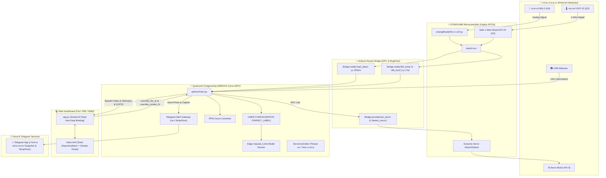
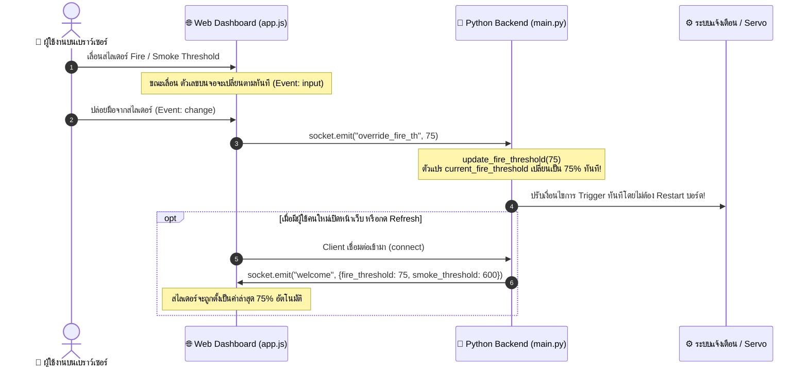

# 🔥 TelegramFireBot: AI Fire & Smoke Safeguard System (Arduino UNO Q)

ระบบตรวจจับอัคคีภัยและควันอัจฉริยะแบบบูรณาการ ออกแบบและปรับแต่งสำหรับบอร์ด **Arduino UNO Q (Qualcomm Dragonwing QRB2210 + STM32U585)** ผ่านแพลตฟอร์ม **Arduino App Lab** พร้อมระบบแสดงผลและควบคุมผ่าน Web Dashboard แบบเรียลไทม์ และระบบแจ้งเตือนฉุกเฉินผ่าน Telegram Bot

---

## 📑 สารบัญ (Table of Contents)

1. [ภาพรวมระบบและจุดเด่น (System Highlights)](#-ภาพรวมระบบและจุดเด่น-system-highlights)
2. [สถาปัตยกรรมการทำงาน (System Architecture)](#-สถาปัตยกรรมการทำงาน-system-architecture)
   - [สถาปัตยกรรม Dual-Brain](#1-สถาปัตยกรรม-dual-brain)
   - [การสื่อสารผ่าน Router Bridge](#2-การสื่อสารผ่าน-router-bridge)
   - [ระบบ Zero-Jitter Servo Control](#3-ระบบ-zero-jitter-servo-control)
   - [การคำนวณระดับควัน MQ-2 เป็นหน่วย ppm](#4-การคำนวณระดับควัน-mq-2-เป็นหน่วย-ppm)
3. [ผังการต่อวงจรและพินฮาร์ดแวร์ (Hardware Wiring & Pinout Guide)](#-ผังการต่อวงจรและพินฮาร์ดแวร์-hardware-wiring--pinout-guide)
   - [ตารางการต่อสายอุปกรณ์](#ตารางการต่อสายอุปกรณ์)
   - [คำแนะนำและข้อควรระวังเรื่องแรงดันไฟฟ้าและเซนเซอร์](#คำแนะนำและข้อควรระวังเรื่องแรงดันไฟฟ้าและเซนเซอร์)
4. [การแสดงผล Web Dashboard และการปรับเปลี่ยนค่าบนเว็บ (Web Interface & Live Controls)](#-การแสดงผล-web-dashboard-และการปรับเปลี่ยนค่าบนเว็บ-web-interface--live-controls)
   - [องค์ประกอบหน้าจอแดชบอร์ด](#องค์ประกอบหน้าจอแดชบอร์ด)
   - [การปรับเปลี่ยนค่าเกณฑ์แจ้งเตือนผ่านสไลเดอร์แบบ Real-time](#การปรับเปลี่ยนค่าเกณฑ์แจ้งเตือนผ่านสไลเดอร์แบบ-real-time)
   - [กลไกการซิงค์ค่าระหว่าง Web Client และ Python Backend](#กลไกการซิงค์ค่าระหว่าง-web-client-และ-python-backend)
5. [ขั้นตอนการนำเข้าสู่ Arduino App Lab (Importing App Guide)](#-ขั้นตอนการนำเข้าสู่-arduino-app-lab-importing-app-guide)
   - [การเตรียมไฟล์และโครงสร้างโฟลเดอร์](#การเตรียมไฟล์และโครงสร้างโฟลเดอร์)
   - [ขั้นตอนการ Import ทีละขั้นตอน](#ขั้นตอนการ-import-ทีละขั้นตอน)
6. [การตั้งค่าให้แอปทำงานอัตโนมัติเมื่อเปิดเครื่อง (Autostart on Boot)](#-การตั้งค่าให้แอปทำงานอัตโนมัติเมื่อเปิดเครื่อง-autostart-on-boot)
   - [ขั้นตอนการเปิดใช้งาน Autostart](#ขั้นตอนการเปิดใช้งาน-autostart)
   - [การนำไปติดตั้งใช้งานจริงแบบ Standalone](#การนำไปติดตั้งใช้งานจริงแบบ-standalone)
7. [คู่มือการเปลี่ยนและอัปเดตโมเดล AI และปรับแต่ง Keyword (AI Model & Keyword Customization Guide)](#-คู่มือการเปลี่ยนและอัปเดตโมเดล-ai-และปรับแต่ง-keyword-ai-model--keyword-customization-guide)
   - [ขั้นตอนที่ 1: ดาวน์โหลดโมเดลใหม่ เปลี่ยนชื่อเป็นชื่อเดิม แล้ววางทับ (วิธีแนะนำ: ง่ายที่สุด 100%)](#ขั้นตอนที่-1-ดาวน์โหลดโมเดลใหม่-เปลี่ยนชื่อเป็นชื่อเดิม-แล้ววางทับ-วิธีแนะนำ-ง่ายที่สุด-100)
   - [ขั้นตอนที่ 2: กำหนด Keyword และธีมที่หัวโค้ด Python (แก้ที่เดียว เว็บเปลี่ยนตามทั้งหมด!)](#ขั้นตอนที่-2-กำหนด-keyword-และธีมที่หัวโค้ด-python-แก้ที่เดียว-เว็บเปลี่ยนตามทั้งหมด)
   - [ขั้นตอนที่ 3: (ทางเลือกเสริม) การเปลี่ยนชื่อแอปในการ์ดของ App Lab](#ขั้นตอนที่-3-ทางเลือกเสริม-การเปลี่ยนชื่อแอปในการ์ดของ-app-lab)
   - [ขั้นตอนที่ 4: การลบแอปเดิมและ Import ใหม่ใน App Lab เพื่อล้างแคช](#ขั้นตอนที่-4-การลบแอปเดิมและ-import-ใหม่ใน-app-lab-เพื่อล้างแคช)
   - [กรณีพิเศษ: หากต้องการตั้งชื่อไฟล์โมเดลเป็นชื่ออื่นจริงๆ](#กรณีพิเศษ-หากต้องการตั้งชื่อไฟล์โมเดลเป็นชื่ออื่นจริงๆ-ไม่แนะนำเพราะต้องแก้หลายจุด)
8. [โครงสร้างไฟล์และโค้ดอย่างละเอียด (Project & Code Structure)](#-โครงสร้างไฟล์และโค้ดอย่างละเอียด-project--code-structure)
9. [การปรับแต่งพารามิเตอร์ระบบในโค้ด (Advanced Configuration)](#-การปรับแต่งพารามิเตอร์ระบบในโค้ด-advanced-configuration)
10. [การแก้ปัญหาที่พบบ่อย (Troubleshooting & FAQ)](#-การแก้ปัญหาที่พบบ่อย-troubleshooting--faq)

---

## 🌟 ภาพรวมระบบและจุดเด่น (System Highlights)

- **AI Target Detection (Flexible Keyword)**: ตรวจจับวัตถุเป้าหมายด้วยโมเดลคอมพิวเตอร์วิชั่นของ Edge Impulse จากภาพสดผ่าน **USB Webcam** แสดงผลกรอบ Bounding Box พร้อมระบุเปอร์เซ็นต์ความมั่นใจ โดยสามารถกำหนด Keyword ของคลาสที่ต้องการตรวจจับได้ง่ายๆ ที่ส่วนหัวของโค้ด Python
- **MQ-2 Smoke Sensor (A0)**: อ่านค่าระดับควันจากเซนเซอร์ MQ-2 ขา A0 แบบความเร็วสูง แปลงสัญญาณทางกายภาพเป็นหน่วย **ppm (Parts Per Million)** ด้วยสมการ Log-Exponential
- **DHT-22 Climate & Ambient Monitor (Pin D2)**: อ่านค่าอุณหภูมิ (°C) และความชื้นสัมพัทธ์ (%) จากเซนเซอร์ DHT-22 ผ่านขาดิจิทัล Pin D2 แสดงผลแบบเรียลไทม์บนหน้าเว็บแดชบอร์ด และรายงานสภาพแวดล้อมประกอบในข้อความแจ้งเตือน Telegram (เพื่อแสดงค่าสภาพแวดล้อมเท่านั้น ไม่นำไปใช้ทริกเกอร์เตือนภัย)
- **Zero-Jitter Servo Actuator (Pin 9)**: ขับมอเตอร์เซอร์โวหมุน 90 องศาเพื่อจำลองการเปิดวาล์วฉีดสารดับเพลิงเป็นเวลา 10 วินาที หมุนกลับ 0 องศา และ **ตัดสัญญาณ PWM ทันที (`detach`)** ขณะสแตนด์บาย เพื่อแก้ปัญหามอเตอร์เซอร์โวสั่นกระตุกหรือเกิดเสียงฮัม 100%
- **Real-time Web Dashboard & Live Sliders**: หน้าจอเว็บมอนิเตอร์ระดับพรีเมียม สไตล์ Dark Glassmorphism สามารถ **ปรับแต่งเกณฑ์แจ้งเตือน (Thresholds) ผ่านสไลเดอร์บนหน้าเว็บได้ทันทีแบบ Real-time** โดยไม่ต้องหยุดหรือคอมไพล์โค้ดใหม่
- **Telegram Emergency Gateway**: แจ้งเตือนภัยทันทีผ่าน Telegram Bot พร้อมส่งภาพถ่ายเหตุการณ์ความละเอียดสูง (Snapshot with HUD Overlay), ข้อมูลระดับตรวจจับ, ข้อมูลอุณหภูมิ/ความชื้น, เวลาตามโซนประเทศไทย และพิกัด GPS แผนที่ Google Maps
- **Standalone Autostart Ready**: รองรับการตั้งค่าให้เปิดเครื่องแล้วรันระบบเองโดยอัตโนมัติ (Autostart) ทำให้ติดตั้งใช้งานเป็นตู้เตือนภัยอัจฉริยะแบบอิสระได้ทันที

---

## 🏛️ สถาปัตยกรรมการทำงาน (System Architecture)



### 1. สถาปัตยกรรม Dual-Brain
Arduino UNO Q รวมเอา 2 หน่วยประมวลผลไว้ในบอร์ดเดียวกัน:
1. **STM32U585 Microcontroller (MCU)**: ทำหน้าที่ควบคุมด้านฮาร์ดแวร์แบบ Real-time I/O ทั้งการสุ่มอ่านค่า Analog ADC ขา A0 และการส่งสัญญาณ PWM ความถี่สูงควบคุมมุมเซอร์โวที่ขา Pin 9
2. **Qualcomm Dragonwing QRB2210 Linux MPU**: หน่วยประมวลผลหลักบนระบบปฏิบัติการ Linux ทำหน้าที่รันโมเดล AI Computer Vision ของ Edge Impulse, วิเคราะห์เฟรมวิดีโอจากกล้อง USB ด้วย OpenCV, รัน Web Server (Socket.IO) และสื่อสารกับเครือข่ายอินเทอร์เน็ตเพื่อส่ง Telegram API

### 2. การสื่อสารผ่าน Router Bridge
การแลกเปลี่ยนข้อมูลระหว่างโลกของ Linux และ MCU ทำงานผ่านไลบรารี `Arduino_RouterBridge`:
- **MCU $\rightarrow$ Linux (Stream Event)**: โค้ดฝั่ง MCU จะอ่านค่า Analog จากเซนเซอร์ MQ-2 และส่ง `Bridge.notify("mq2_data", raw)` ทุก 200ms ให้โค้ด Python ฝั่ง Linux รับไปประมวลผลต่อ
- **Linux $\rightarrow$ MCU (RPC Call)**: สคริปต์ Python สั่งการเซอร์โวมอเตอร์ผ่าน `Bridge.call("set_servo", angle)` และ `Bridge.call("detach_servo")`

### 3. ระบบ Zero-Jitter Servo Control
เซอร์โวมอเตอร์ทั่วไปหากได้รับสัญญาณ PWM 50Hz ค้างไว้แม้จะไม่ได้สั่งเคลื่อนที่ มักจะเกิดปัญหาเรื่อง **เสียงฮัม (Humming noise)** หรือมี **อาการสั่นกระตุก (Idle Jitter)** ตลอดเวลา ในระบบนี้จึงใช้เทคนิค **Dynamic Attach/Detach**:
1. **ขณะ Standby**: โค้ดสั่ง `fireServo.detach()` ดับสัญญาณ PWM ทำให้เซอร์โวนิ่งสนิท ไม่กินกระแส และไม่มีเสียงรบกวน
2. **เมื่อพบไฟ (Fire $\ge$ Threshold)**: สั่ง `fireServo.attach(9)` $\rightarrow$ หมุนไปที่ 90 องศา $\rightarrow$ ค้างไว้ 10 วินาทีเพื่อจำลองการฉีดดับเพลิง
3. **เมื่อครบเวลา**: สั่งหมุนกลับมาที่ 0 องศา $\rightarrow$ หน่วงเวลา 1.5 วินาทีให้มอเตอร์วิ่งเข้าตำแหน่งสมบูรณ์ $\rightarrow$ สั่ง `detach()` ปิดสัญญาณ PWM
4. **Cooldown 60 วินาที**: ป้องกันกลไกทำงานซ้ำซ้อนอย่างต่อเนื่อง หากครบ 60 วินาทีแล้วยังตรวจพบไฟอยู่ ระบบจะสั่งวนลูปทำงานซ้ำอัตโนมัติ

### 4. การคำนวณระดับควัน MQ-2 เป็นหน่วย ppm
ฟังก์ชัน `raw_to_smoke_ppm(raw_val)` แปลงค่าดิบจาก Analog ADC (0–1023) เป็นค่าความหนาแน่นของควันในหน่วย **ppm (Parts Per Million)** ตามความโค้งการตอบสนองของเซนเซอร์ MQ-2:
$$\text{ppm} = 50.0 \times \left(1.0 + \left(\frac{\text{raw}}{80.0}\right)^{1.8}\right)$$
- **อากาศบริสุทธิ์ (Clean Air)**: $\approx 50 - 150 \text{ ppm}$
- **ควันจางๆ (Mild Smoke)**: $\approx 300 - 500 \text{ ppm}$
- **ควันหนาแน่น (Dense Smoke / Fire Hazard)**: $\ge 600 - 3,000 \text{ ppm}$

---

## 🔌 ผังการต่อวงจรและพินฮาร์ดแวร์ (Hardware Wiring & Pinout Guide)

### ตารางการต่อสายอุปกรณ์

| อุปกรณ์ | ขาบนตัวอุปกรณ์ | สีสายไฟมาตรฐาน | ขาบนบอร์ด Arduino UNO Q | คำอธิบายหน้าที่ |
| :--- | :--- | :--- | :--- | :--- |
| **เซนเซอร์ MQ-2** | **VCC** | สีแดง | **5V** | ขาจ่ายไฟเลี้ยงโมดูลเซนเซอร์ |
| | **GND** | สีดำ | **GND** | ขากราวด์ร่วมของระบบ |
| | **AO (Analog Out)** | สีเขียว / ขาว | **A0 (Analog In)** | สัญญาณแรงดันอนาล็อกระดับควัน/ก๊าซ |
| **เซนเซอร์ DHT-22** | **VCC (+)** | สีแดง | **3.3V หรือ 5V** | ขาจ่ายไฟเลี้ยงโมดูล (แนะนำ 3.3V ให้ตรงระดับ Logic) |
| | **DATA (Out)** | สีเหลือง / ขาว | **Pin 2 (D2)** | สัญญาณดิจิทัล 1-Wire อ่านค่าอุณหภูมิและความชื้น |
| | **GND (-)** | สีดำ / น้ำเงิน | **GND** | ขากราวด์ร่วมของระบบ |
| **Servo Motor** | **VCC** | สีแดง | **5V** | ขาจ่ายไฟเลี้ยงแกนมอเตอร์ |
| | **GND** | สีน้ำตาล / สีดำ | **GND** | ขากราวด์ร่วมของระบบ |
| | **Signal (PWM)** | สีส้ม / สีเหลือง | **Pin 9 (D9 / PWM)** | สัญญาณพัลส์ควบคุมองศาการหมุน |
| **USB Webcam** | **USB-A Plug** | สาย USB ดั้งเดิม | **USB Host Port** | เสียบเข้าช่องพอร์ต USB-A ของบอร์ด UNO Q |

### คำแนะนำและข้อควรระวังเรื่องแรงดันไฟฟ้าและเซนเซอร์

> [!NOTE]
> **ข้อแนะนำสำหรับเซนเซอร์ DHT-22 (Pin D2):**
> 1. **การต่อสายไฟเลี้ยง:** แนะนำให้ต่อไฟเลี้ยงที่ขา **3.3V** ของบอร์ด Arduino UNO Q เพื่อให้สัญญาณดิจิทัลตรงกับระดับแรงดันของไมโครคอนโทรลเลอร์พอดี
> 2. **ตัวต้านทาน Pull-up:** หากใช้เซนเซอร์ DHT-22 แบบโมดูลสำเร็จรูป (มีแผ่นวงจร 3 ขา) ตัวต้านทาน Pull-up จะถูกบัดกรีอยู่บนบอร์ดแล้ว สามารถต่อเข้าขา D2 ได้ทันที แต่หากใช้ตัวถังสีขาว 4 ขาแบบเปล่าๆ ให้ต่อตัวต้านทาน $4.7\text{k}\Omega - 10\text{k}\Omega$ คั่นระหว่างขา DATA กับ VCC
> 3. **จุดประสงค์การทำงาน:** ค่าจาก DHT-22 มีไว้วัดและ**แสดงผลสภาพแวดล้อม (อุณหภูมิและความชื้น) บนหน้าเว็บ และแนบในข้อความ Telegram เพื่อเป็นข้อมูลอ้างอิงเท่านั้น** จะไม่มีผลต่อการกระตุ้นเตือนภัยหรือขับมอเตอร์เซอร์โว

> [!WARNING]
> **ข้อควรระวังเรื่องแรงดันไฟขา Analog (A0):**
> 1. ขา Analog A0–A5 บนบอร์ด Arduino UNO Q รองรับแรงดันอินพุตสูงสุดไม่เกิน **3.3V** 
> 2. บอร์ดโมดูล MQ-2 ทั่วไปที่ใช้ไฟเลี้ยง 5V อาจปล่อยแรงดันขา AO ออกมาได้สูงสุด 4–5V เมื่อเจอกลุ่มควันหนาแน่นมาก
> 3. **คำแนะนำในการติดตั้ง:**
>    - หมุนปรับตัวต้านทานปรับค่าได้ (Potentiometer สีฟ้า) บนตัวโมดูล MQ-2 เพื่อปรับระดับความไวให้อยู่ในย่านปลอดภัย
>    - หรือต่อวงจรแบ่งแรงดัน (Voltage Divider) โดยใช้ตัวต้านทาน $1\text{k}\Omega$ และ $2\text{k}\Omega$ คั่นก่อนเข้าขา A0
>
> **การวอร์มเซนเซอร์ (Burn-in Time):**
> เซนเซอร์ตระกูล MQ ทุกรุ่นมีขดลวดความร้อนภายใน เมื่อเสียบไฟใช้งานครั้งแรกจะต้องรอประมาณ **3–5 นาที** เพื่อให้เซนเซอร์อุ่นและอ่านค่าได้อย่างคงที่และแม่นยำ

---

## 💻 การแสดงผล Web Dashboard และการปรับเปลี่ยนค่าบนเว็บ (Web Interface & Live Controls)

ระบบ TelegramFireBot มาพร้อมกับหน้าจอแดชบอร์ด **Web Dashboard** ควบคุมและแสดงผลแบบเรียลไทม์ผ่าน WebSocket (Socket.IO) ทำงานที่พอร์ต **`7000`** (หรือ `8080` ตามคอนฟิก):
- เข้าใช้งานภายในบอร์ด: `http://localhost:7000`
- เข้าใช้งานจากคอมพิวเตอร์หรือสมาร์ตโฟนผ่าน Wi-Fi วงเดียวกัน: `http://<IP_ของบอร์ด_UNO_Q>:7000`

| ส่วนหน้าจอ (Dashboard Section) | องค์ประกอบ | ข้อมูลที่แสดงผลและการทำงาน |
| :--- | :--- | :--- |
| **ฝั่งซ้าย: แผงกล้องสด (Live Feed)** | **🔴 Live Video Feed** | สตรีมวิดีโอสด 640x480 (~25 FPS) จากกล้อง USB Webcam ผ่าน Base64 JPEG |
| | **AI Bounding Box** | กรอบสี่เหลี่ยมสีแดงครอบตำแหน่งเปลวไฟ พร้อมเปอร์เซ็นต์ความมั่นใจของโมเดล |
| | **HUD Overlay (มุมบนซ้าย)** | กล่องมอนิเตอร์สดบนวิดีโอ: `Fire (AI)`, `Smoke (MQ2)`, `DHT22 (D2)`, `Servo` |
| **ฝั่งขวา: แผงควบคุมและสถานะ** | **📊 Telemetry Status** | มาตรวัดระดับไฟ `Fire Level (AI)` (0–100%) และระดับควัน `Smoke Level` (ppm) |
| | **🌡️ Climate & Ambient** | เซนเซอร์ DHT-22 (Pin D2) แสดงอุณหภูมิ (°C) และความชื้นสัมพัทธ์ (%) |
| | **⚙️ Servo Actuator** | สถานะมอเตอร์เซอร์โว `STANDBY` / `ACTIVE (90°)` / `COOLDOWN (60s)` |
| | **🎚️ Alert Thresholds** | สไลเดอร์ปรับเกณฑ์ `Fire Threshold` (1–100%) และ `Smoke Threshold` (ppm) |
| | **🚨 Telegram Gateway** | จำนวนข้อความที่ส่งสำเร็จ (`Total Dispatched`) และประวัติการแจ้งเตือน 5 ครั้งล่าสุด |

### องค์ประกอบหน้าจอแดชบอร์ด

1. **🔴 Live Video Feed (การ์ดแสดงผลกล้องสด)**
   - สตรีมภาพวิดีโอความละเอียดสูงจากกล้อง USB Webcam แบบ Base64 JPEG อัตราเร่งประมาณ 25 FPS
   - **AI Bounding Box**: เมื่อโมเดลตรวจพบเป้าหมาย ระบบจะวาดกรอบสี่เหลี่ยมสีแดงครอบตำแหน่งวัตถุบนภาพแบบสด พร้อมระบุเปอร์เซ็นต์ความมั่นใจ
   - **HUD Telemetry Overlay**: มีกล่องมอนิเตอร์สีดำโปร่งแสงซ้อนอยู่มุมบนซ้ายของภาพ แสดงข้อมูลสด:
     - `Target (AI): X% (Th: Y%)`
     - `Smoke (MQ2): X ppm (Th: Y)`
     - `DHT22 (D2): XX.XC | XX.X%`
     - `Servo (Pin 9): STATE (Angle/Countdown)`
2. **📊 Telemetry Status (มาตรวัดระดับเซนเซอร์)**
   - **🔥 Fire Level (AI)**: มาตรวัดความมั่นใจของ AI พร้อมแท่ง Progress Bar แสดง 0–100% (ตัวเลขและแท่งจะเปลี่ยนจากสีเขียวเป็นสีแดงทันทีเมื่อระดับไฟแตะเกณฑ์)
   - **💨 Smoke Level (MQ-2 A0)**: แสดงความเข้มข้นของควันเป็นหน่วย **ppm** พร้อมแท่ง Progress Bar สเกล 0–3,000 ppm และแสดงค่าดิบ `Sensor Raw (A0): XXX` ด้านล่าง
3. **🌡️ Climate & Ambient (สภาพแวดล้อม DHT22 Pin D2)**
   - แสดงค่าอุณหภูมิห้อง/สภาพแวดล้อม (°C) และความชื้นสัมพัทธ์ (%) พร้อมแถบสี Gradient ส้ม/ฟ้า แสดงสภาวะอากาศแบบ Real-time (เป็นข้อมูลสภาพแวดล้อมอ้างอิงเท่านั้น ไม่นำไปใช้ทริกเกอร์เตือนภัย)
4. **⚙️ Servo Actuator Panel (แผงสถานะเซอร์โว Pin 9)**
   - แสดงสถานะการทำงาน 3 สภาวะ:
     - **`STANDBY` (สีเขียว)**: เซอร์โวหยุดนิ่ง ตัดสัญญาณ PWM (`detach`) ไร้การสั่นไหว
     - **`ACTIVE` (สีแดง)**: กำลังหมุนไปที่ 90 องศาเพื่อเปิดระบบดับเพลิง (หน่วงเวลา 10 วินาที)
     - **`COOLDOWN` (สีส้ม)**: หมุนกลับมาที่ 0 องศา ตัดสัญญาณ PWM และแสดงเวลานับถอยหลัง `60s... 59s...`
5. **🚨 Telegram Gateway Panel (ประวัติการส่งแจ้งเตือน)**
   - แสดงตัวเลขจำนวนครั้งที่ส่งแจ้งเตือนสำเร็จ (`Total Dispatched`)
   - แสดงสถานะล่าสุดของการส่ง (`Last Gateway Status: Standby / Success / Failed`)
   - กล่อง `History Logs` แสดงประวัติเวลาของเหตุการณ์ฉุกเฉินล่าสุด

---

### การปรับเปลี่ยนค่าเกณฑ์แจ้งเตือนผ่านสไลเดอร์แบบ Real-time

บนหน้าเว็บมีแถบสไลเดอร์ให้ผู้ควบคุมสามารถปรับค่าเกณฑ์ความไว (Thresholds) ได้อย่างอิสระตามสภาพแวดล้อมจริง:

1. **🔥 Fire Camera Threshold (สไลเดอร์เกณฑ์ตรวจจับไฟ)**:
   - ปรับได้ตั้งแต่ **1% ถึง 100%** (ค่าเริ่มต้น: `80%`)
   - **ผลลัพธ์**: หากความมั่นใจของ AI มีค่ามากกว่าหรือเท่ากับค่านี้ ระบบจะ:
     - สั่งให้เซอร์โวมอเตอร์หมุน 90 องศาฉีดสารดับเพลิง
     - สั่งให้ระบบถ่ายภาพ Snapshot ส่งแจ้งเตือนฉุกเฉินเข้า Telegram
2. **💨 Smoke Sensor Threshold (สไลเดอร์เกณฑ์ระดับควัน)**:
   - ปรับได้ตั้งแต่ **100 ถึง 3,000 ppm** โดยขยับครั้งละ 50 ppm (ค่าเริ่มต้น: `600 ppm`)
   - **ผลลัพธ์**: หากระดับควันที่อ่านได้จากขา A0 มีค่ามากกว่าหรือเท่ากับค่านี้ ระบบจะ:
     - สั่งให้ระบบถ่ายภาพ Snapshot ส่งแจ้งเตือนฉุกเฉินเข้า Telegram เพื่อแจ้งเตือนว่ามีกลุ่มควันผิดปกติ

### กลไกการซิงค์ค่าระหว่าง Web Client และ Python Backend



> [!TIP]
> **ไม่ต้องหยุดโปรแกรม ไม่ต้องรีสตาร์ต:** การปรับสไลเดอร์บนหน้าเว็บจะส่งสัญญาณผ่าน Socket.IO อัปเดตตัวแปรในหน่วยความจำของ Python ทันที ทำให้คุณสามารถจูนเกณฑ์ความไวของเซนเซอร์และกล้องให้เข้ากับแสงและควันในห้องทดสอบได้แบบสดๆ ตลอดเวลา

---

## 🚀 ขั้นตอนการนำเข้าสู่ Arduino App Lab (Importing App Guide)

### การเตรียมไฟล์และโครงสร้างโฟลเดอร์

ก่อนเริ่มนำเข้าสู่โปรแกรม Arduino App Lab ให้ตรวจสอบว่าไฟล์โปรเจกต์มีโครงสร้างครบถ้วนดังนี้:

```
TelegramFireBot/
├── app.yaml                 # ไฟล์คอนฟิกแอปหลักของ App Lab
├── wildfire-dt-model.eim    # โมเดล Edge Impulse (.eim)
├── python/
│   ├── main.py              # โค้ดหลักฝั่ง Linux (Webcam, AI, Bridge, Servo, Telegram)
│   └── requirements.txt     # ระบุไลบรารี edge_impulse_linux
├── sketch/
│   ├── sketch.ino           # โค้ด MCU STM32 อ่าน A0 และคุม Servo
│   └── sketch.yaml          # คอนฟิกไลบรารี Arduino_RouterBridge และ Servo
└── assets/
    ├── index.html           # หน้ากาก Web Dashboard
    ├── style.css            # สไตล์ Dark Glassmorphism
    ├── app.js               # สคริปต์ Socket.IO รับส่งข้อมูล
    └── libs/                # ไลบรารีออฟไลน์ socket.io และ qrcode
```

> [!TIP]
> คุณสามารถเลือกนำเข้าได้ 2 รูปแบบ:
> 1. นำเข้าเป็น **โฟลเดอร์โปรเจกต์ `TelegramFireBot`** โดยตรง
> 2. บีบอัดโฟลเดอร์ให้เป็นไฟล์ **`TelegramFireBot.zip`** (โดยข้างใน Zip ต้องประกอบด้วยไฟล์ `app.yaml`, โฟลเดอร์ `python/`, `sketch/`, `assets/` อยู่ที่ Root ของ Zip ทันที)

---

### ขั้นตอนการ Import ทีละขั้นตอน

1. **เปิดโปรแกรม Arduino App Lab**:
   - เชื่อมต่อบอร์ด **Arduino UNO Q** เข้ากับคอมพิวเตอร์ผ่านสาย Type-C
   - เปิดโปรแกรม **Arduino App Lab** แล้วรอให้โปรแกรมตรวจสอบสถานะของบอร์ดจนขึ้นว่าเชื่อมต่อเรียบร้อย
2. **เข้าสู่เมนูนำเข้าแอป (Import App)**:
   - ที่หน้าหลักของโปรแกรม มองหาปุ่ม **"Import App"** (หรือคลิกที่เครื่องหมาย **`+`** / Add Application)
3. **เลือกไฟล์โปรเจกต์**:
   - เลือกตัวเลือก **Import from ZIP** (เลือกไฟล์ `TelegramFireBot.zip`) หรือ **Import from Folder** (เลือกโฟลเดอร์โปรเจกต์)
4. **รอ App Lab เตรียมสภาพแวดล้อม**:
   - โปรแกรมจะอ่านไฟล์ `app.yaml` เพื่อดึง Bricks ที่เกี่ยวข้อง (`video_object_detection`, `web_ui`)
   - โปรแกรมจะสร้าง Python Virtual Environment และติดตั้งไลบรารีจาก `python/requirements.txt`
   - โปรแกรมจะคอมไพล์และแฟลชเฟิร์มแวร์ในโฟลเดอร์ `sketch/` ลงสู่ชิป STM32U585 ด้วย Zephyr RTOS ให้โดยอัตโนมัติ
5. **เริ่มการทำงาน (Run)**:
   - กดปุ่ม **"Run"** สีเขียวที่มุมบนขวา
   - ตรวจสอบหน้าต่าง Logs เพื่อดูสถานะการเปิดกล้อง USB Webcam และการโหลดโมเดล AI
   - คลิกเปิดหน้า Web Dashboard ที่พอร์ต `7000` เพื่อเริ่มใช้งาน

---

## ⚡ การตั้งค่าให้แอปทำงานอัตโนมัติเมื่อเปิดเครื่อง (Autostart on Boot)

เมื่อคุณต้องการนำบอร์ด Arduino UNO Q ไปประกอบลงกล่อง และติดตั้งในอาคารหรือโรงงานเพื่อใช้งานเป็นอุปกรณ์เตือนภัยอัคคีภัยแบบ **Standalone (ทำงานเดี่ยวๆ โดยไม่ต้องต่อคอมพิวเตอร์)** คุณต้องเปิดใช้งานฟังก์ชัน **Autostart**:

### ขั้นตอนการเปิดใช้งาน Autostart

1. เปิดโปรแกรม **Arduino App Lab** ขณะที่เชื่อมต่อกับบอร์ด
2. ไปที่หน้าแท็บ **Apps** หรือหน้ารายการแอปที่ติดตั้งอยู่บนบอร์ด (Installed Applications)
3. ค้นหาการ์ดแอปพลิเคชัน **`TelegramFireBot`**
4. มองหาสวิตช์ Toggle หรือตัวเลือกที่เขียนว่า **"Autostart"** หรือ **"Run on startup"**
   - หรือคลิกที่ปุ่มเมนูจุด 3 จุด (`...`) บนการ์ดแอป แล้วเลือกคำสั่ง **"Set as Autostart"**
5. เลื่อนสวิตช์ให้เป็น **ON (เปิดใช้งาน)**
6. สังเกตจะมีสัญลักษณ์ไอคอนรูปเข็มกลัดหรือข้อความสีเขียวระบุว่า **`Autostart: Enabled`** บนการ์ดแอป

> ⚡ **ข้อมูลบนการ์ดแอปเมื่อเปิด Autostart สำเร็จ:**
> - **ชื่อแอป:** `🔥 TelegramFireBot`
> - **คำอธิบาย:** `Fire and Smoke Detection with Telegram Alert`
> - **สถานะ (Status):** `Installed`
> - **การทำงานอัตโนมัติ (Autostart):** `[ ON ] ⚡ (Runs automatically on device boot)`
> - **พอร์ตการเชื่อมต่อ (Ports):** `7000 / 8080`

### การนำไปติดตั้งใช้งานจริงแบบ Standalone

- **การจ่ายไฟ**: สามารถใช้ Adapter จ่ายไฟ 5V (กระแสอย่างน้อย 2.5A - 3A) เสียบเข้าช่อง Type-C ของบอร์ด Arduino UNO Q ได้โดยตรง
- **ลำดับการบูตเครื่องอัตโนมัติ (Cold Boot Workflow)**:
  1. เมื่อเสียบปลั๊กไฟ บอร์ดจะเริ่มบูตระบบ Linux บนชิป Qualcomm และบูต Zephyr RTOS บนชิป STM32 (~20-30 วินาที)
  2. ระบบ Autostart จะสั่งเปิดคอนเทนเนอร์ของ TelegramFireBot ขึ้นมาทันที
  3. กล้อง USB Webcam จะเปิดทำงาน โมเดล AI จะถูกโหลดเข้าสู่ RAM และเซนเซอร์ MQ-2 จะเริ่มสตรีมข้อมูล
  4. มอเตอร์เซอร์โวจะอยู่ในโหมด Standby ตัดสัญญาณ PWM เพื่อป้องกันการสั่น
  5. บอร์ดจะเชื่อมต่อ Wi-Fi และพร้อมส่งแจ้งเตือน Telegram ทันทีที่มีเหตุเพลิงไหม้เกิดขึ้น แม้ไม่มีคอมพิวเตอร์เชื่อมต่ออยู่ก็ตาม!

---

## 🧠 คู่มือการเปลี่ยนและอัปเดตโมเดล AI และปรับแต่ง Keyword (AI Model & Keyword Customization Guide)

หากคุณต้องการเปลี่ยนไปใช้โมเดลใหม่ที่เทรนเองจาก **Edge Impulse** ไม่ว่าจะเป็นโมเดลตรวจจับไฟรุ่นปรับปรุง หรือต้องการนำระบบไปประยุกต์ใช้กับงานตรวจจับประเภทอื่น (เช่น ตรวจจับคน `person`, ตรวจหมวกนิรภัย `helmet`, ยานพาหนะ `car` หรือควัน `smoke`) **วิธีที่ง่ายและสะดวกที่สุดคือ: เปลี่ยนชื่อโมเดลใหม่ให้เป็นชื่อเดิมแล้ววางทับ โดยไม่ต้องแก้โค้ดคอนฟิกเลย!**

---

### ขั้นตอนที่ 1: ดาวน์โหลดโมเดลใหม่ เปลี่ยนชื่อเป็นชื่อเดิม แล้ววางทับ (วิธีแนะนำ: ง่ายที่สุด 100%)

> [!TIP]
> **🌟 เคล็ดลับสุดง่าย (The Simplest & Recommended Way):**
> คุณ**ไม่ต้องเข้าไปแก้ไขโค้ดใน `app.yaml` หรือแก้ชื่อไฟล์ใน `python/main.py` เลยแม้แต่บรรทัดเดียว!**
> เพียงแค่ **เปลี่ยนชื่อไฟล์โมเดลใหม่ที่เพิ่งดาวน์โหลดมา ให้กลายเป็นชื่อเดิมคือ `wildfire-dt-model.eim`** แล้วนำไปวางทับไฟล์เดิมได้ทันที!

#### วิธีการทำทีละสเต็ป:
1. **ดาวน์โหลดโมเดลจาก Edge Impulse**:
   - เข้าสู่โปรเจกต์ของคุณบน [Edge Impulse Studio](https://studio.edgeimpulse.com/)
   - ไปที่แถบเมนู **Deployment** ทางซ้ายมือ
   - ในช่องค้นหา Deployment options ให้พิมพ์เลือก **Linux (ARM)** หรือ **Linux (AARCH64)** ตามสถาปัตยกรรมชิป
   - คลิกปุ่ม **Build** เพื่อสร้างแพ็กเกจไบนารี จะได้ไฟล์นามสกุล `.eim` ออกมา (เช่น `my-new-model.eim`)
2. **เปลี่ยนชื่อไฟล์โมเดลใหม่ ให้เป็นชื่อเดิม**:
   - เปลี่ยนชื่อไฟล์ที่เพิ่งดาวน์โหลดมาให้กลายเป็นชื่อเดิมเป๊ะๆ:
     ```bash
     wildfire-dt-model.eim
     ```
3. **วางทับ (Overwrite/Replace) ไฟล์เดิมในโฟลเดอร์โปรเจกต์**:
   - นำไฟล์ `wildfire-dt-model.eim` ตัวใหม่นี้ ไปคัดลอกวางทับไฟล์เดิมในโฟลเดอร์โปรเจกต์ (หรือลากใส่ไฟล์ Zip ทับไฟล์เดิม) ได้ทันที!
   - **เสร็จสิ้น!** ไม่ต้องไปแตะต้องไฟล์ `app.yaml` หรือชื่อโมเดลใน Python เลย

---

### ขั้นตอนที่ 2: กำหนด Keyword และธีมที่หัวโค้ด Python (แก้ที่เดียว เว็บเปลี่ยนตามทั้งหมด!)

ระบบ TelegramFireBot ได้รับการออกแบบสถาปัตยกรรมให้มี **Single Source of Truth**:
> [!TIP]
> **🌟 แก้จุดเดียว เปลี่ยนครบทั้งระบบ (1-Click Centralized Configuration):**
> คุณสามารถเปิดไฟล์ **[`python/main.py`](file:///home/ctrlaltnate/Downloads/TelegramFireBot/TelegramFireBot/python/main.py)** แล้วแก้ไขเฉพาะบล็อก `⚙️ USER CONFIGURATION` (บรรทัดที่ 30–42) **ไม่ต้องเข้าไปแก้ไขไฟล์ `index.html` หรือ `app.js` เลยแม้แต่บรรทัดเดียว!**
> เมื่อเปิดหน้าเว็บแดชบอร์ด ระบบจะซิงค์ข้อมูลผ่าน Socket.IO ปรับเปลี่ยนชื่อระบบ, ไอคอน, แผงตรวจวัด, ป้ายสไลเดอร์, กล่อง HUD วิดีโอสด และข้อความ Telegram Alert ให้ตรงกันทั้งหมดโดยอัตโนมัติ!

#### การตั้งค่าใน [`python/main.py`](file:///home/ctrlaltnate/Downloads/TelegramFireBot/TelegramFireBot/python/main.py):

```python
# ==========================================
# ⚙️ USER CONFIGURATION (ส่วนตั้งค่าสำหรับผู้ใช้งาน)
# 🌟 แก้จุดนี้จุดเดียว! หน้าเว็บแดชบอร์ด, สไลเดอร์, กล่อง HUD วิดีโอสด และ Telegram จะเปลี่ยนตามทั้งหมดอัตโนมัติ
# ==========================================
# ค่าตั้งต้นเดิมของระบบ: ตรวจจับไฟ (Fire)
TARGET_LABEL = "fire"              # Keyword จากโมเดล Edge Impulse เช่น "fire", "person", "smoke", "helmet", "car"
TARGET_DISPLAY_NAME = "Fire"       # ชื่อแสดงผล เช่น "Fire", "Person", "Safety Helmet"
TARGET_ICON = "🔥"                 # ไอคอนแสดงผล เช่น "🔥", "👤", "⛑️", "🚗", "🎯"
APP_TITLE = "Fire & Smoke AI"      # ชื่อหัวเว็บ/ระบบ เช่น "Fire & Smoke AI", "Person AI Guard"
```

**ตัวอย่างเมื่อต้องการเปลี่ยนไปตรวจจับ "คน" (`Person`):**
เพียงแค่เปลี่ยนค่าในบล็อกนี้ใน `python/main.py`:

```python
TARGET_LABEL = "person"            # Label ให้ตรงกับที่เทรนใน Edge Impulse
TARGET_DISPLAY_NAME = "Person"     # ชื่อแสดงผล
TARGET_ICON = "👤"                 # ไอคอนบนหน้าเว็บและ Telegram
APP_TITLE = "Person AI Guard"      # ชื่อหัวเว็บแดชบอร์ด
```

#### สิ่งที่ระบบจะอัปเดตให้อัตโนมัติทันที:
1. **🌐 Web Dashboard (หน้าเว็บแดชบอร์ด)**:
   - ไอคอนหัวเว็บเปลี่ยนเป็น `👤`
   - ชื่อหัวเว็บเปลี่ยนเป็น `Person AI Guard`
   - แผง Telemetry เปลี่ยนเป็น `👤 Person Level (AI)`
   - ป้ายกำกับสไลเดอร์เปลี่ยนเป็น `👤 Person Camera Threshold`
   - ข้อความคำอธิบายสไลเดอร์และบันทึกแจ้งเตือนเปลี่ยนเป็น `Person Alert` อัตโนมัติ
2. **📹 กล้องสด (Live Video & HUD Overlay)**:
   - กรอบ Bounding Box สีแดงจะครอบจับเฉพาะคลาส `person` และมีป้ายชื่อ `Person: XX%`
   - กล่องข้อมูล HUD มุมบนซ้ายจะแสดง `Person (AI): XX.X% (Th: 80%)`
3. **🚨 Telegram Alert**:
   - ข้อความแจ้งเตือนจะส่งว่า: `🚨 ALARM: Person Detected! 🚨`
   - บรรทัดรายงานระดับความมั่นใจจะแสดง: `👤 Person Level: XX.X%`

---

### ขั้นตอนที่ 3: (ทางเลือกเสริม) การเปลี่ยนชื่อแอปในการ์ดของ App Lab

หากต้องการให้ชื่อการ์ดแอปพลิเคชันในโปรแกรม **Arduino App Lab** เปลี่ยนชื่อด้วย สามารถเข้าไปแก้ที่ไฟล์ [`app.yaml`](file:///home/ctrlaltnate/Downloads/TelegramFireBot/TelegramFireBot/app.yaml) ได้โดยตรง:

```yaml
name: TelegramPersonBot
description: Person Detection with Telegram Alert
...
icon: 👤
```
*(หากไม่แก้ App Lab จะยังคงแสดงการ์ดชื่อเดิม แต่การทำงานและหน้าเว็บจะทำงานด้วยโมเดลใหม่ 100%)*

---

### ขั้นตอนที่ 4: การลบแอปเดิมและ Import ใหม่ใน App Lab เพื่อล้างแคช

เมื่อมีการสลับโมเดล AI ไบนารี `.eim` ตัวใหม่ คอนเทนเนอร์ของ Arduino App Lab อาจมีการแคชไฟล์โมเดลเก่าไว้ **วิธีที่สะอาด ถูกต้อง และไม่เกิดปัญหาแคชค้าง 100% คือ**:

```
[ 1. กด Stop แอปเดิม ]
          ↓
[ 2. คลิกปุ่ม '...' บนการ์ดแอป แล้วเลือก 'Delete' เพื่อลบแอปเดิมออกจากบอร์ด ]
          ↓
[ 3. คลิก 'Import App' แล้วเลือกไฟล์ Zip หรือโฟลเดอร์โปรเจกต์ที่วางโมเดลใหม่แล้ว ]
          ↓
[ 4. กด 'Run' เพื่อให้ App Lab สร้างคอนเทนเนอร์และโหลดโมเดลใหม่อย่างบริสุทธิ์ ]
```

1. ในหน้าต่าง **Arduino App Lab** ให้กดปุ่ม **Stop** บนการ์ดแอป
2. คลิกปุ่มจุดสามจุด **`...`** บนการ์ดแอป แล้วเลือก **Delete** เพื่อลบแอปเดิมออก
3. คลิกปุ่ม **Import App** ที่แถบเครื่องมือ
4. เลือกโฟลเดอร์โปรเจกต์ (หรือไฟล์ `.zip` ที่เตรียมไว้)
5. รอ App Lab แตกไฟล์และจัดเตรียม จากนั้นกดปุ่ม **Run**
6. ตรวจสอบในแท็บ Logs จะต้องพบข้อความ:
   ```
   Ensured executable permissions for /.../wildfire-dt-model.eim
   Edge Impulse model initialized successfully from: /.../wildfire-dt-model.eim
   Model info: ...
   ```
   ระบบจะเริ่มทำงานด้วยโมเดลใหม่ Keyword ใหม่ และหน้าเว็บใหม่ทันที!

---

### กรณีพิเศษ: หากต้องการตั้งชื่อไฟล์โมเดลเป็นชื่ออื่นจริงๆ (ไม่แนะนำเพราะต้องแก้หลายจุด)

หากจำเป็นต้องตั้งชื่อไฟล์โมเดลเป็นชื่ออื่น เช่น `custom-model.eim` คุณจะต้องไปตามแก้จุดอ้างอิงเอง 2 ไฟล์:
1. **[`app.yaml`](file:///home/ctrlaltnate/Downloads/TelegramFireBot/TelegramFireBot/app.yaml)** (บรรทัดที่ 8–9): แก้ไขตัวแปร `EI_OBJ_DETECTION_MODEL` และ `EI_V_OBJ_DETECTION_MODEL` เป็นชื่อใหม่
2. **[`python/main.py`](file:///home/ctrlaltnate/Downloads/TelegramFireBot/TelegramFireBot/python/main.py)** (บรรทัดที่ 46): แก้ไข `MODEL_PATH = "custom-model.eim"`
*(แนะนำให้ใช้วิธีเปลี่ยนชื่อเป็น `wildfire-dt-model.eim` แล้ววางทับตาม **ขั้นตอนที่ 1** จะง่าย รวดเร็ว และปลอดภัยที่สุด)*

---

## 📂 โครงสร้างไฟล์และโค้ดอย่างละเอียด (Project & Code Structure)

### 1. `app.yaml`
ไฟล์ประกาศคุณลักษณะแอปพลิเคชันสำหรับ **Arduino App Lab**:
- กำหนดชื่อแอป `TelegramFireBot` และไอคอน 🔥
- เปิดพอร์ตสื่อสาร `8080` สำหรับระบบ WebUI
- ผูกโมเดล Edge Impulse ผ่าน Brick `arduino:video_object_detection`
- เรียกใช้คอมโพเนนต์เว็บเซิร์ฟเวอร์ผ่าน Brick `arduino:web_ui`

### 2. `python/main.py`
แกนกลางของระบบที่ประมวลผลบน Linux MPU (Qualcomm Dragonwing):
- **ระบบกำหนดเป้าหมายยืดหยุ่น (`TARGET_LABEL` & `TARGET_DISPLAY_NAME`)**: กำหนดคีย์เวิร์ดคลาสที่ต้องการตรวจจับได้จากส่วนหัวของโค้ด พร้อมส่งชื่อและสถานะไปซิงค์กับหน้าเว็บและ Telegram Alert
- **ระบบ Auto-chmod โมเดล**: มีคำสั่ง `os.chmod()` อัตโนมัติ ป้องกัน Error สิทธิ์การ Execute (`+x`) ของไฟล์ `.eim`
- **คลาส `ServoController`**: ควบคุมเซอร์โวมอเตอร์แบบ State Machine ผ่านเธรดแยก (`threading.Thread`) ทำให้การหน่วงเวลา 10 วินาที และการนับถอยหลัง Cooldown 60 วินาที ไม่ไปหน่วงการประมวลผลของกล้องวิดีโอและหน้าเว็บ
- **ฟังก์ชัน `raw_to_smoke_ppm()`**: แปลงค่า ADC จากขา A0 เป็นหน่วย ppm อ้างอิงสมการ Exponential Curve
- **ระบบจัดการเซนเซอร์ DHT-22 (Pin D2)**: รับสตรีมอุณหภูมิและความชื้นผ่าน Bridge RPC เพื่อแสดงผลสภาพแวดล้อมบน Web Dashboard และแนบใน Telegram Alert
- **ฟังก์ชัน `trigger_telegram_alert()`**: เข้ารหัสภาพถ่ายเป็น JPEG ความละเอียดสูง แนบพิกัด Google Maps ค่าอุณหภูมิ/ความชื้น วันที่และเวลาโซนไทย ส่งผ่าน Telegram Bot API พร้อมระบบป้องกันสแปม `TELEGRAM_COOLDOWN` 20 วินาที
- **ระบบ Socket.IO Handlers**:
  - รับสัญญาณ `override_fire_th` และ `override_smoke_th` จากสไลเดอร์หน้าเว็บมาปรับเกณฑ์ทันที
  - ส่งข้อมูล `detection`, `servo_status`, `telegram_status` และสตรีมภาพ `video_frame` ไปยังหน้าเว็บแบบเรียลไทม์

### 3. `sketch/sketch.ino` & `sketch.yaml`
เฟิร์มแวร์ฝั่งชิปไมโครคอนโทรลเลอร์ STM32U585:
- `sketch.yaml`: กำหนดโปรไฟล์บอร์ด `arduino:zephyr:unoq` และนำเข้าไลบรารี `Arduino_RouterBridge` และ `Servo`
- `sketch.ino`:
  - ฟังก์ชัน `read_mq2()`: อ่านค่า `analogRead(A0)`
  - ฟังก์ชัน `read_dht22()`: อ่านค่าอุณหภูมิและความชื้นสัมพัทธ์จากขา **Digital Pin 2 (D2)** ด้วยโปรโตคอล 1-Wire แบบปลอดภัย
  - ฟังก์ชัน `set_servo(angle)`: สั่ง `fireServo.attach(9)` เมื่อต้องการหมุน และสั่ง `fireServo.write(angle)`
  - ฟังก์ชัน `detach_servo()`: สั่ง `fireServo.detach()` เพื่อตัดสัญญาณ PWM อย่างเด็ดขาด ป้องกันเซอร์โวสั่น
  - ในฟังก์ชัน `loop()`:
    - สตรีม `Bridge.notify("mq2_data", mq2_raw)` ทุก 200ms
    - สตรีม `Bridge.notify("dht_temp", temp)` และ `Bridge.notify("dht_hum", hum)` ทุก 2.5 วินาที

### 4. `assets/` (Web Dashboard)
- `index.html`: โครงสร้างหน้าเว็บ แบ่งเป็นแผงวิดีโอสด (Live Feed) พร้อม HUD Overlay, แผง Telemetry, แผงตรวจวัดสภาพแวดล้อม (DHT22 Climate Panel), แผงเซอร์โว, สไลเดอร์ปรับเกณฑ์คู่ และประวัติแจ้งเตือน Telegram
- `style.css`: ตกแต่งด้วยธีม Dark Glassmorphism ผสมผสาน Neon Glow, Smooth Gradient และรองรับ Responsive บนแท็บเล็ต/มือถือ
- `app.js`: เชื่อมต่อ Socket.IO, ซิงค์ข้อมูลสไลเดอร์แบบ 2-way data binding, อัปเดตข้อมูล DHT22 และชื่อ Target Label แบบ Real-time

---

## ⚙️ การปรับแต่งพารามิเตอร์ระบบในโค้ด (Advanced Configuration)

หากต้องการแก้ไขการตั้งค่าเริ่มต้นของระบบ ให้เปิดไฟล์ [`python/main.py`](file:///home/ctrlaltnate/Downloads/TelegramFireBot/TelegramFireBot/python/main.py) และปรับแต่งพารามิเตอร์ในบรรทัดที่ 27–47:

| ตัวแปรในโค้ด | ค่าเริ่มต้น | รายละเอียดและการตั้งค่า |
| :--- | :--- | :--- |
| `INPUT_MODE` | `"WEBCAM"` | โหมดรับภาพ: ใช้ `"WEBCAM"` สำหรับกล้อง USB ทั่วไป |
| `TARGET_LABEL` | `"fire"` | Keyword คลาสที่ต้องการตรวจจับจากโมเดล Edge Impulse (เช่น `"fire"`, `"person"`, `"helmet"`) |
| `TARGET_DISPLAY_NAME` | `"Fire"` | ชื่อที่ต้องการแสดงบนหน้าจอแดชบอร์ด, HUD และในข้อความ Telegram |
| `TARGET_ICON` | `"🔥"` | ไอคอนประจำคลาสที่จะแสดงบนหน้าเว็บและ Telegram (เช่น `"🔥"`, `"👤"`, `"⛑️"`, `"🚗"`, `"🎯"`) |
| `APP_TITLE` | `"Fire & Smoke AI"` | ชื่อระบบบนหัวเว็บแดชบอร์ด (เช่น `"Fire & Smoke AI"`, `"Person AI Guard"`) |
| `TELEGRAM_TOKEN` | `"8859583...nmXI"` | Bot Token ที่ได้รับจาก `@BotFather` |
| `TELEGRAM_CHAT_ID` | `"7246017877"` | Chat ID ของผู้ใช้ หรือ Group ID ของกลุ่ม Telegram ที่ต้องการรับแจ้งเตือน |
| `DEFAULT_FIRE_THRESHOLD` | `80.0` | เกณฑ์ความมั่นใจตรวจจับไฟเริ่มต้น (1% – 100%) หากแตะเกณฑ์จะหมุน Servo และส่ง Telegram |
| `DEFAULT_SMOKE_THRESHOLD` | `600.0` | เกณฑ์ระดับควันเริ่มต้น (100 – 3,000 ppm) หากแตะเกณฑ์จะส่ง Telegram |
| `TELEGRAM_COOLDOWN` | `20` | ระยะเวลาหน่วงระหว่างการส่ง Telegram แต่ละข้อความ (วินาที) ป้องกันข้อความสแปม |
| `LATITUDE` / `LONGITUDE` | `"-"` | พิกัดจุดติดตั้งของกล่อง ใช้สร้างลิงก์เปิดแผนที่ Google Maps ในข้อความเตือน |
| `MODEL_PATH` | `"wildfire-dt-model.eim"` | ชื่อไฟล์โมเดล Edge Impulse ที่ต้องการโหลด |

---

## 🛠️ การแก้ปัญหาที่พบบ่อย (Troubleshooting & FAQ)

#### Q1: ภาพจากกล้อง USB ไม่แสดง หรือขึ้นข้อความแจ้งว่ากล้องเปิดไม่ได้?
- **สาเหตุ**: บนบอร์ด Arduino UNO Q กล้อง USB มาตรฐาน UVC อาจถูกแมปเป็นอุปกรณ์ตำแหน่งอื่น เช่น `/dev/video2` หรือ `/dev/video0`
- **วิธีแก้ปัญหา**: สคริปต์ `open_usb_camera()` ในโค้ดปัจจุบันถูกออกแบบให้ทดสอบเปิดกล้องตามลำดับ `[2, 0, 1]` โดยอัตโนมัติแล้ว หากยังไม่ติด ให้ตรวจสอบว่าเสียบสาย USB แน่นหรือไม่ หรือลองถอดสายกล้องออกแล้วเสียบใหม่ จากนั้นตรวจสอบว่าไฟ LED บนตัวกล้องติดสว่างหรือไม่

#### Q2: มอเตอร์เซอร์โวสั่นกระตุก หรือมีเสียงฮัมตลอดเวลาแม้ไม่มีไฟ?
- **สาเหตุ**: เกิดจากสัญญาณคลื่น PWM 50Hz ถูกส่งไปยังเซอร์โวค้างไว้ตลอดเวลา
- **วิธีแก้ปัญหา**: โค้ดในโปรเจกต์นี้ได้รับการแก้ไขด้วยระบบ **Zero-Jitter Control** โดยสั่ง `detach_servo()` ตัดสัญญาณ PWM ทันทีที่เข้าสู่สถานะ Standby หากเซอร์โวยังคงสั่น ให้ตรวจสอบสายกราว (GND) ระหว่างบอร์ดกับเซอร์โวว่าต่อร่วมกันแน่นหนาดีหรือไม่

#### Q3: นำเข้าแอปแล้วเจอ Error: Model file is not executable?
- **สาเหตุ**: ไฟล์โมเดล `.eim` ถูกบีบอัดในระบบปฏิบัติการ Windows ทำให้ค่า Permission การรันไฟล์ (Execute bit) สูญหายไป
- **วิธีแก้ปัญหา**: ในสคริปต์ `python/main.py` ได้เพิ่มคำสั่ง `os.chmod()` ให้โดยอัตโนมัติก่อนเริ่มอินิเชียลไลซ์โมเดล ปัญหานี้จึงได้รับการแก้ไขอย่างสมบูรณ์แบบแล้ว

#### Q4: ค่าควันจากเซนเซอร์ MQ-2 อ่านได้ 50 ppm นิ่งๆ หรือแกว่งสูงมาก?
- **สาเหตุ**: เซนเซอร์ตระกูล MQ ทุกรุ่นจำเป็นต้องใช้เวลาอุ่นเครื่อง (Burn-in) หลังจากเสียบไฟประมาณ 3–5 นาที
- **วิธีแก้ปัญหา**: ให้รอสักครู่เพื่อให้ขดลวดความร้อนภายในเซนเซอร์ทำงานคงที่ จากนั้นทดสอบนำควันธูปหรือก๊าซไฟแช็กมาจ่อใกล้ๆ จะพบว่าค่าดิบ ADC และค่า ppm ดีดตัวสูงขึ้นอย่างชัดเจน

#### Q5: เปลี่ยนโมเดล AI ใหม่แล้ว แต่ทำไมระบบยังทำงานเหมือนโมเดลเก่า?
- **สาเหตุ**: Arduino App Lab อาจมีการบันทึกแคชของคอนเทนเนอร์เดิมไว้
- **วิธีแก้ปัญหา**: ให้ปฏิบัติตามคู่มือใน [หัวข้อที่ 7](#-คู่มือการเปลี่ยนและอัปเดตโมเดล-ai-ai-model-replacement-guide) โดยการ **กด Stop $\rightarrow$ ลบแอปเดิมทิ้ง (Delete) $\rightarrow$ Import ไฟล์ Zip ตัวใหม่เข้ามาใหม่** จะทำให้ระบบสร้างสภาพแวดล้อมใหม่และโหลดโมเดลใหม่อย่างแน่นอน
